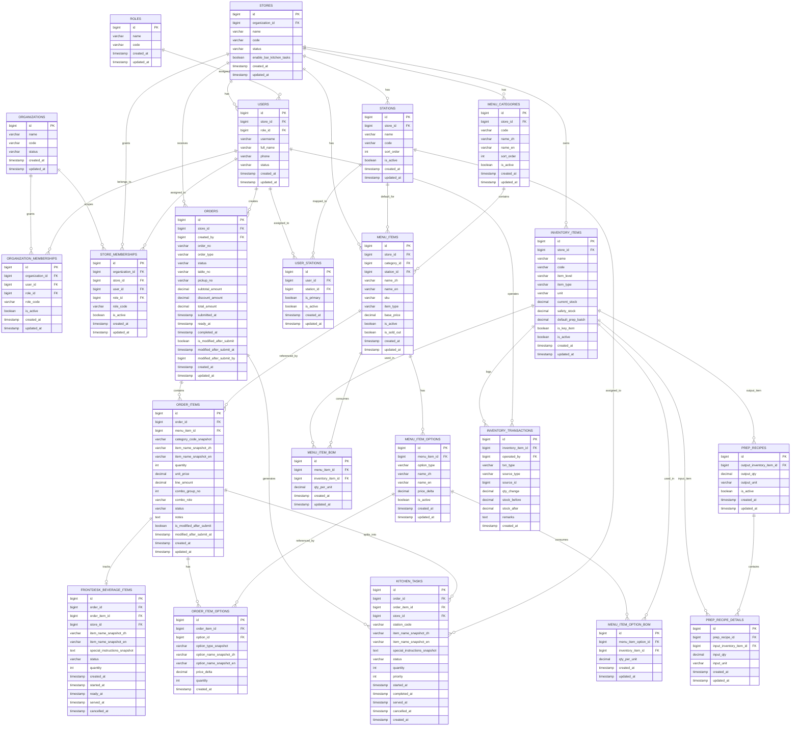

# 🍜 餐厅管理系统数据库设计（MVP）

---

# 1. 文档目的

本文档用于定义餐厅管理系统 MVP 阶段的核心数据库结构，支持以下业务闭环：

- 前台点单
- 后厨制作
- 出餐台显示
- 库存扣减
- 备菜提醒
- 店长原料补货提醒
- 基础经营报表

---

# 2. 设计原则

## 2.1 核心原则
- 以订单（Order）为业务主线
- 以库存流水（Inventory Transaction）记录所有库存变化
- 区分备菜项（Prep Item）与原料项（Raw Material）
- 支持菜品 BOM 和备菜 BOM 两层结构
- 先满足 MVP，避免过早复杂化

---

## 2.2 MVP 支持范围
本设计优先支持：

- 堂食 / 自取订单
- 菜品与加料项
- 后厨工位任务
- 出餐台 Ready Screen
- 自动扣减库存
- 低库存提醒
- 备菜与补货记录

---

# 3. ERD（实体关系图）

    
# 4. 核心数据模型说明

---

## 4.1 订单主线

订单相关表：

- `orders`
- `order_items`
- `order_item_options`

作用：
- 存储订单头、订单行、加料项
- 作为厨房任务与库存扣减的触发源
- Combo 仅作为销售/定价概念存在，不作为独立 kitchen item
- Combo 订单由真实 `order_items` 组成，通过 `combo_group_no` + `combo_role` 分组

---

## 4.2 后厨执行主线

后厨相关表：

- `stations`
- `user_stations`
- `kitchen_tasks`

作用：
- 支持订单拆分到不同工位
- 支持每个工位独立处理任务
- 为 Ready Screen 和制作状态流转提供基础
- MVP 中每个 `menu_item` 仅配置一个默认工位，使用 `menu_items.station_id`

---

## 4.3 库存主线

库存相关表：

- `inventory_items`
- `menu_item_bom`
-  `menu_item_option_bom`
- `prep_recipes`
- `prep_recipe_details`
- `inventory_transactions`

作用：
- 支持菜品售卖扣减库存
- 支持备菜动作消耗原料并增加备菜项
- 支持采购补货入库
- 支持库存流水追踪

---

## 4.4 菜品与 Combo 建模规则（MVP）

### 核心规则

- Combo 是销售规则，不是独立菜品
- 所有出品都必须对应真实 `menu_items`
- 面类主品、配菜、鸡蛋都可作为真实下单项进入 `order_items`
- 厨房任务只针对真实 `order_items` 生成
- 历史订单展示必须读取快照字段，不依赖当前菜单主数据

---

## 4.5 双语建模规则（MVP）

### 默认语言

- 中文为默认显示语言
- 英文为可切换显示语言
- 语言切换只影响展示，不影响业务逻辑

### 主数据双语字段

- `menu_categories.name_zh`
- `menu_categories.name_en`
- `menu_items.name_zh`
- `menu_items.name_en`
- `menu_item_options.name_zh`
- `menu_item_options.name_en`

### 订单快照双语字段

- `order_items.item_name_snapshot_zh`
- `order_items.item_name_snapshot_en`
- `order_item_options.option_name_snapshot_zh`
- `order_item_options.option_name_snapshot_en`

### 快照规则

- 创建订单时必须从菜单主数据复制中英文字段到快照
- 订单创建后快照不得随主数据修改而变化
- 历史订单、收据、后厨小票、补打单据、导出报表都应优先读取快照字段
- 需要用于显示或路由判断的关键分类信息也应进入快照，例如 `category_code_snapshot`、`option_type_snapshot`

### Combo 表示方式

- 主面：`combo_role = main`
- 套餐配菜：`combo_role = combo_side`
- 套餐鸡蛋：`combo_role = combo_egg`
- 单点：`combo_role = standalone`

同一套餐中的主面、配菜、鸡蛋共享同一个 `combo_group_no`。

### 单点规则

- 非套餐单点项：`combo_group_no = null`
- 非套餐单点项：`combo_role = standalone`

### 选项建模（按菜品独立配置）

`menu_item_options` 必须按 `menu_item_id` 单独配置，不使用全局选项。

推荐的 `option_type`：

- `noodle_type`
- `size`
- `addon`
- `remove`
- `soup_base`
- `combo_side`
- `combo_egg`
- `combo_upgrade`

### 当前业务映射说明

- 牛肉面：默认 `三细`，汤面，支持 `Regular/Large`，支持 `走萝卜/走肉/加肉`
- 素菜面：汤面，默认汤底 `素面汁`，可切换 `牛肉汤`，支持面型与 `Regular/Large`
- 炸酱面：干拌，支持面型，不支持 `Large`，支持加面，支持 `走黄瓜/走胡萝卜/走毛豆`，支持加炸酱
- 担担面：干拌，支持面型，不支持 `Large`，支持加面
- 炒面类：可单点，也可升级 Combo，固定 `二细`，POS 不显示面型选择，仅 `Regular`
- 小菜：`凉拌黄瓜`、`毛豆`、`凉拌土豆丝`，既可单点也可作为套餐配菜
- 鸡蛋：`茶叶蛋`、`煎蛋`，可作为套餐鸡蛋，也可按需要单点

---

# 5. 数据库设计

---

## 5.1 stores（门店表）

### 说明
存储门店信息。

| 字段 | 类型 | 说明 |
|------|------|------|
| id | bigint PK | 主键 |
| name | varchar | 门店名称 |
| code | varchar | 门店编码 |
| status | varchar | 状态 |
| enable_bar_kitchen_tasks | boolean | 是否启用 BAR 出品任务流 |
| created_at | timestamp | 创建时间 |
| updated_at | timestamp | 更新时间 |

---

## 5.2 roles（角色表）

### 说明
定义系统角色（店长、前台、后厨等）。

| 字段 | 类型 | 说明 |
|------|------|------|
| id | bigint PK | 主键 |
| name | varchar | 角色名称 |
| code | varchar | 角色编码 |

MVP 固定角色编码：

- `FRONTDESK`
- `HOT_KITCHEN`
- `NOODLE_VIEW`
- `PASS`
- `ADMIN`

---

## 5.3 users（用户表）

### 说明
系统用户信息。

| 字段 | 类型 | 说明 |
|------|------|------|
| id | bigint PK | 主键 |
| store_id | bigint FK | 门店 |
| role_id | bigint FK | 角色 |
| username | varchar | 登录名 |
| full_name | varchar | 姓名 |

---

## 5.4 menu_categories（菜品分类）

### 说明
用于对菜品进行分类。

| 字段 | 类型 | 说明 |
|------|------|------|
| id | bigint PK | 主键 |
| store_id | bigint FK | 门店 |
| code | varchar | 分类编码 |
| name_zh | varchar | 中文名称 |
| name_en | varchar | 英文名称 |
| sort_order | int | 排序 |
| is_active | boolean | 是否启用 |

MVP 固定分类编码：

- `SOUP_NOODLE`
- `DRY_NOODLE`
- `FRIED_NOODLE`
- `SIDE`
- `EGG`
- `FRIED`
- `COLD_APPETIZER`
- `DRINK`
- `MILK_TEA`
- `ALCOHOL`

---

## 5.5 menu_items（菜品表）

### 说明
存储菜品信息。

| 字段 | 类型 | 说明 |
|------|------|------|
| id | bigint PK | 主键 |
| name_zh | varchar | 中文名称 |
| name_en | varchar | 英文名称 |
| station_id | bigint FK | 默认出餐工位（MVP 单工位） |
| base_price | decimal | 价格 |
| is_active | boolean | 是否启用 |

---

## 5.6 menu_item_options（菜品选项）

### 说明
定义菜品可选项（如加蛋、加面）。

| 字段 | 类型 | 说明 |
|------|------|------|
| id | bigint PK | 主键 |
| menu_item_id | bigint FK | 菜品 |
| option_type | varchar | 选项类型 |
| name_zh | varchar | 中文名称 |
| name_en | varchar | 英文名称 |
| price_delta | decimal | 加价 |
| is_active | boolean | 是否启用 |

---

## 5.7 orders（订单表）

### 状态
- draft  
- submitted  
- preparing  
- ready  
- picked_up  
- completed  

| 字段 | 类型 | 说明 |
|------|------|------|
| id | bigint PK | 主键 |
| order_no | varchar | 订单号 |
| status | varchar | 状态 |
| total_amount | decimal | 总金额 |

---

## 5.8 order_items（订单明细）

| 字段 | 类型 | 说明 |
|------|------|------|
| id | bigint PK | 主键 |
| order_id | bigint FK | 订单 |
| menu_item_id | bigint FK | 菜品 |
| category_code_snapshot | varchar | 分类编码快照 |
| item_name_snapshot_zh | varchar | 菜品中文快照 |
| item_name_snapshot_en | varchar | 菜品英文快照 |
| quantity | int | 数量 |
| combo_group_no | int | 套餐分组号，可空 |
| combo_role | varchar | main / combo_side / combo_egg / standalone |

---

## 5.9 order_item_options（订单选项）

### 说明
记录订单中选择的选项。

| 字段 | 类型 | 说明 |
|------|------|------|
| id | bigint PK | 主键 |
| order_item_id | bigint FK | 订单明细 |
| menu_item_option_id | bigint FK | 选项 |
| option_type_snapshot | varchar | 选项类型快照 |
| option_name_snapshot_zh | varchar | 选项中文快照 |
| option_name_snapshot_en | varchar | 选项英文快照 |
| quantity | int | 数量 |

---

## 5.10 stations（工位表）

### 说明
定义厨房工位（拉面、炸物等）。

| 字段 | 类型 | 说明 |
|------|------|------|
| id | bigint PK | 主键 |
| store_id | bigint FK | 门店 |
| name | varchar | 工位名称 |
| code | varchar | 工位编码 |
| is_active | boolean | 是否启用 |

说明：

- MVP 不引入菜品与工位多对多映射表
- 菜品默认工位直接配置在 `menu_items.station_id`
- 固定工位代码建议：
  - `NOODLE`
  - `WOK`
  - `COLD`
  - `DEEPFRIED`
  - `BAR`

---

## 5.11 kitchen_tasks（厨房任务）

| 字段 | 类型 | 说明 |
|------|------|------|
| id | bigint PK | 主键 |
| order_id | bigint FK | 订单 |
| order_item_id | bigint FK | 来源 |
| store_id | bigint FK | 门店 |
| station_code | varchar | 工位编码快照 |
| item_name_snapshot_zh | varchar | 菜品中文快照 |
| item_name_snapshot_en | varchar | 菜品英文快照 |
| special_instructions_snapshot | text | 备注与后厨相关选项快照 |
| status | varchar | 状态 |
| quantity | int | 数量 |
| priority | int | 优先级，可空 |
| started_at | timestamp | 开始时间 |
| completed_at | timestamp | 放到取餐架时间（ready_for_pickup） |
| served_at | timestamp | Runner/服务员取走时间 |
| cancelled_at | timestamp | 取消时间 |
| created_at | timestamp | 创建时间 |

说明：

- `kitchen_tasks` 在订单提交时生成，不在 draft 创建时生成
- 任务名称必须读取下单时的双语快照，不依赖当前菜单主数据
- `station_code` 从 `menu_items.station_id` 解析出的已启用工位复制而来
- 如果配置工位未在该门店启用，则提交订单必须报错
- `DRINK` 与 `ALCOHOL` 不生成任务
- `MILK_TEA` 是否进入 `BAR` 任务流由 `stores.enable_bar_kitchen_tasks` 控制
- 当门店未启用 BAR 任务流时，`MILK_TEA` 进入 frontdesk beverage 视图，不生成任务
- MVP 一条 `order_item` 默认生成一条任务，数量使用 `quantity`

---

## 5.12 frontdesk_beverage_items（前台饮品处理项）

| 字段 | 类型 | 说明 |
|------|------|------|
| id | bigint PK | 主键 |
| order_id | bigint FK | 订单 |
| order_item_id | bigint FK | 来源订单项 |
| store_id | bigint FK | 门店 |
| item_name_snapshot_zh | varchar | 菜品中文快照 |
| item_name_snapshot_en | varchar | 菜品英文快照 |
| special_instructions_snapshot | text | 备注与选项快照 |
| status | varchar | 饮品处理状态 |
| quantity | int | 数量 |
| created_at | timestamp | 创建时间 |
| started_at | timestamp | 开始制作时间 |
| ready_at | timestamp | 制作完成时间 |
| served_at | timestamp | 交付时间 |
| cancelled_at | timestamp | 取消时间 |

说明：

- 此表只用于前台处理的饮料/酒水/本店 taskless milk tea
- 数据在订单提交时生成，不在 draft 阶段生成
- 分类依赖 `order_items.category_code_snapshot` 与门店配置，不依赖当前菜单主数据
- 不会影响后厨 `kitchen_tasks` 的 READY 判定
- 历史显示必须继续使用快照字段

---

## 5.13 inventory_items（库存项）

### 分类
- raw_material（原料）  
- prep_item（备菜）  
- estimate_item（估算）  

| 字段 | 类型 | 说明 |
|------|------|------|
| id | bigint PK | 主键 |
| name | varchar | 名称 |
| current_stock | decimal | 当前库存 |
| safety_stock | decimal | 安全库存 |

---

## 5.13 menu_item_bom（菜品 BOM）

| 字段 | 类型 | 说明 |
|------|------|------|
| id | bigint PK | 主键 |
| menu_item_id | bigint FK | 菜品 |
| inventory_item_id | bigint FK | 库存项 |
| qty_per_unit | decimal | 用量 |

---

## 5.14 menu_item_option_bom（选项库存消耗）

### 说明
定义选项对库存的额外消耗。

| 字段 | 类型 | 说明 |
|------|------|------|
| id | bigint PK | 主键 |
| menu_item_option_id | bigint FK | 选项 |
| inventory_item_id | bigint FK | 库存项 |
| qty_per_unit | decimal | 用量 |

---

## 5.15 user_stations（员工工位映射）

### 说明
定义员工与工位的关系。

| 字段 | 类型 | 说明 |
|------|------|------|
| id | bigint PK | 主键 |
| user_id | bigint FK | 员工 |
| station_id | bigint FK | 工位 |
| is_primary | boolean | 是否主工位 |
| is_active | boolean | 是否启用 |

---

## 5.16 prep_recipes（备菜配方）

### 说明
定义备菜产出。

| 字段 | 类型 | 说明 |
|------|------|------|
| id | bigint PK | 主键 |
| output_inventory_item_id | bigint FK | 产出库存 |
| output_qty | decimal | 产出数量 |

---

## 5.17 prep_recipe_details（备菜明细）

### 说明
定义备菜消耗原料。

| 字段 | 类型 | 说明 |
|------|------|------|
| id | bigint PK | 主键 |
| prep_recipe_id | bigint FK | 配方 |
| input_inventory_item_id | bigint FK | 原料 |
| input_qty | decimal | 用量 |

---

## 5.18 inventory_transactions（库存流水）

### 类型
- consume  
- purchase_in  
- manual_adjust  

| 字段 | 类型 | 说明 |
|------|------|------|
| id | bigint PK | 主键 |
| inventory_item_id | bigint FK | 库存 |
| qty_change | decimal | 变化量 |
| created_at | timestamp | 时间 |

---

# 6. 核心流程说明

本系统的核心流程围绕订单驱动，分别触发库存消耗、备菜生产以及原料补货三类行为。库存操作分为两种类型：

- 消耗型（Consumption）：库存减少
- 补给型（Replenishment）：库存增加

---

## 6.1 下单扣库存（Order Consumption Flow）

### 描述
当用户完成点单后，系统根据菜品配置的 BOM 自动扣减对应库存项。

菜品本体消耗来自 `menu_item_bom`
菜品选项消耗来自 `menu_item_option_bom`
Combo 不作为独立菜品扣库存，套餐中的主品/配菜/鸡蛋都按真实 `order_items` 分别扣库存
`DRINK` 和 `ALCOHOL` 分类为 direct-serve，不生成 `kitchen_tasks`
`MILK_TEA` 分类归 `BAR` 工位，是否生成 `kitchen_tasks` 取决于门店是否启用 BAR 任务流

### 处理流程

1. 用户提交订单（orders）
2. 系统生成订单明细（order_items）
3. 订单状态从 `draft` 更新为 `submitted`
4. 厨房开始处理后，订单状态进入 `preparing`
5. 遍历每个订单明细项：
   - 根据 `menu_item_bom` 查询对应库存消耗
6. 对每个库存项执行：
   - 扣减 `inventory_items.current_stock`
   - 写入一条库存流水（inventory_transactions）

### 数据变更

- inventory_items.current_stock：减少
- inventory_transactions：新增记录（txn_type = consume）

### 示例

- 用户点一碗大碗拉面：
  - 汤底 -150 ml
  - 面条 -1 份
  - 卤蛋（如选）-1 个

---

## 6.2 抓码备料（Preparation Flow）

### 描述
当备菜库存（prep_item）低于安全值时，抓码人员进行备料操作，通过消耗原料（raw_material）来生产备菜项。

### 处理流程

1. 系统检测备菜库存低于 `safety_stock`
2. 提醒抓码人员进行备料
3. 抓码选择备料类型（如：煮鸡蛋 / 制作汤底）
4. 系统根据 `prep_recipes` 执行：

   - 扣减原料库存（raw_material）
   - 增加备菜库存（prep_item）

5. 分别记录库存流水：

   - 原料：txn_type = prep_input（负数）
   - 备菜：txn_type = prep_output（正数）

### 数据变更

- 原料库存：减少
- 备菜库存：增加
- inventory_transactions：新增两类记录

### 示例

煮 30 个卤鸡蛋：

- 生鸡蛋 -30
- 卤鸡蛋 +30

---

## 6.3 店长补货（Replenishment Flow）

### 描述
当原料库存低于安全值时，系统提醒店长进行采购或补货操作。

⚠️ 注意：该流程属于“补给型操作”，只会增加库存，不参与扣减逻辑。

### 处理流程

1. 系统检测原料库存低于 `safety_stock`
2. 提醒店长进行补货
3. 店长确认采购/调拨数量
4. 系统执行入库操作：

   - 增加 `inventory_items.current_stock`

5. 写入库存流水：

   - txn_type = purchase_in（正数）

### 数据变更

- inventory_items.current_stock：增加
- inventory_transactions：新增记录

### 示例

店长采购：

- 生鸡蛋 +200
- 面粉 +20袋
- 可乐 +2箱

---

## 6.4 库存流统一说明（重要）

系统中所有库存变动必须通过 `inventory_transactions` 记录，实现完整可追溯性。

### 库存变动来源

| 来源 | 类型 | 说明 |
|------|------|------|
| 订单 | consume | 菜品销售扣减库存 |
| 备料（原料） | prep_input | 原料消耗 |
| 备料（产出） | prep_output | 备菜增加 |
| 采购 | purchase_in | 原料补货 |
| 手动调整 | manual_adjust | 人工修正 |

---

## 6.5 关键设计原则

1. 所有库存变化必须记录流水（inventory_transactions）
2. 扣减与补货必须分离，避免逻辑混乱
3. 订单只影响“消耗”，不参与补货逻辑
4. 备料是连接原料与备菜的桥梁
5. 店长补货只作用于原料层（raw_material）

---

# 7. 索引建议

为了提升查询性能，建议添加以下索引：

## orders
- index(order_no)
- index(status)
- index(created_at)

## order_items
- index(order_id)

## inventory_items
- index(name)

## inventory_transactions
- index(inventory_item_id, created_at)

---

# 8. MVP 简化建议

## 必做模块

- orders
- order_items
- inventory_items
- inventory_transactions
- menu_item_bom

---

## 可后期扩展

- prep_recipes（备菜配方）
- 自动补货逻辑
- 复杂库存预测

---

# 9. 状态枚举

## 9.1 订单状态（orders.status）

- draft（草稿，初始状态）
- submitted（已下单）
- preparing（制作中）
- ready（已备好待取）
- picked_up（已取餐）
- completed（完成）

## 9.2 套餐角色（order_items.combo_role）

- main
- combo_side
- combo_egg
- standalone

## 9.3 后厨任务状态（kitchen_tasks.status）

- pending
- in_progress
- ready_for_pickup
- served
- cancelled

## 9.4 库存流水类型（inventory_transactions.txn_type）

- consume（消耗）
- purchase_in（采购入库）
- manual_adjust（手动调整）

---

# 10. 示例数据

---

## 示例 1：加卤蛋

菜品：拉面 + 加蛋

库存变化：卤鸡蛋 -1

---

## 示例 2：素汤底消耗
中碗：-100 ml
大碗：-150 ml

---

# 11. 系统主流程总结

系统核心数据流：Order → Kitchen → Inventory → Reporting

说明：

- Order 驱动整个系统
- Kitchen 负责执行
- Inventory 负责数据一致性
- Reporting 用于分析
