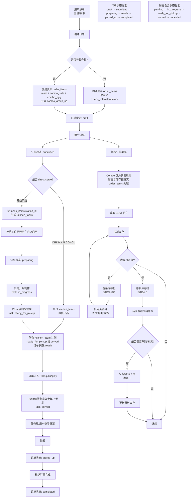

```mermaid
flowchart TD

A[用户点单<br>堂食/自取] --> B[创建订单]

B --> B0{是否套餐升级?}
B0 -->|否| B1[创建真实 order_items<br>单点项 combo_role=standalone]
B0 -->|是| B2[创建真实 order_items<br>main + combo_side + combo_egg<br>共享 combo_group_no]
B1 --> B3[订单状态: draft]
B2 --> B3[订单状态: draft]
B3 --> C[提交订单]
C --> C1[订单状态: submitted]

C1 --> C2{是否 direct-serve?}
C2 -->|DRINK / ALCOHOL| C3[跳过 kitchen_tasks<br>直接出品]
C2 -->|其他菜品| D[按 menu_items.station_id<br>生成 kitchen_tasks]
D --> D0[校验工位是否已在门店启用]
D0 --> D1[订单状态: preparing]
C3 --> E1[订单状态: ready]

D1 --> E[厨房开始制作<br>task: in_progress]
E --> F0[Pass 放到取餐架<br>task: ready_for_pickup]
F0 --> E1[所有 kitchen_tasks 达到<br>ready_for_pickup 或 served<br>订单状态: ready]

E1 --> F[订单进入 Pickup Display]

F --> G[Runner/服务员取走单个餐品<br>task: served]

G --> H[服务员/用户查看屏幕]

H --> I[取餐]
I --> I1[订单状态: picked_up]

I1 --> J[标记订单完成]

J --> K[订单状态: completed]

%% 标准订单状态
Z[订单状态标准<br>draft → submitted → preparing → ready → picked_up → completed]
Z1[厨房任务状态标准<br>pending → in_progress → ready_for_pickup → served → cancelled]

%% 库存并行流程
C --> L[解析订单菜品]
L --> L1[Combo 仅为销售规则<br>厨房与库存按真实 order_items 处理]
L1 --> M[读取 BOM 配方]
M --> N[扣减库存]

N --> O{库存是否低?}

O -->|否| Q[继续]

%% 分流
O -->|是| P1[备菜库存低<br>提醒抓码员]
O -->|是| P2[原料库存低<br>提醒店长]

%% 抓码流程（消耗原料 → 回补备菜）
P1 --> R[抓码员备料<br>如煮鸡蛋/做汤]
R --> N

%% 店长流程（新增库存 ✔️）
P2 --> S[店长查看原料库存]
S --> T{是否需要采购/补货?}

T -->|是| U[采购/补货入库<br>库存 +]
T -->|否| Q

U --> V[更新原料库存]
V --> Q
```
