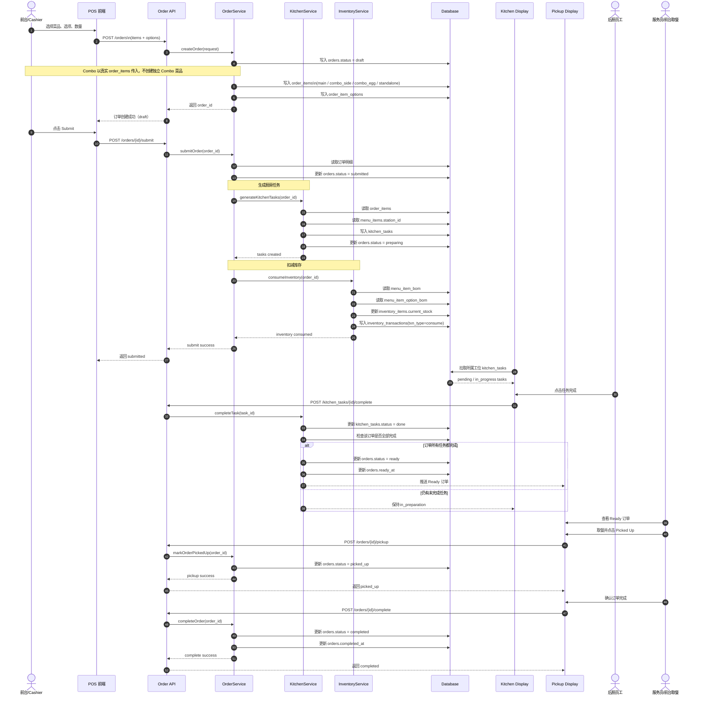

```mermaid
sequenceDiagram
    autonumber

    actor Cashier as 前台/Cashier
    participant POS as POS 前端
    participant OrderAPI as Order API
    participant OrderService as OrderService
    participant KitchenService as KitchenService
    participant InventoryService as InventoryService
    participant DB as Database
    participant KDS as Kitchen Display
    participant ReadyScreen as Pickup Display

    Cashier->>POS: 选择菜品、选项、数量
    POS->>OrderAPI: POST /orders\n(items + options)
    OrderAPI->>OrderService: createOrder(request)

    OrderService->>DB: 写入 orders.status = draft
    Note over Cashier,OrderService: Combo 以真实 order_items 传入，不创建独立 Combo 菜品
    OrderService->>DB: 写入 order_items\n(main / combo_side / combo_egg / standalone)
    OrderService->>DB: 写入 order_item_options
    OrderService-->>OrderAPI: 返回 order_id
    OrderAPI-->>POS: 订单创建成功（draft）

    Cashier->>POS: 点击 Submit
    POS->>OrderAPI: POST /orders/{id}/submit
    OrderAPI->>OrderService: submitOrder(order_id)

    OrderService->>DB: 读取订单明细
    OrderService->>DB: 更新 orders.status = submitted

    Note over OrderService,KitchenService: 生成厨房任务
    OrderService->>KitchenService: generateKitchenTasks(order_id)
    KitchenService->>DB: 读取 order_items
    KitchenService->>DB: 读取 menu_items.station_id
    KitchenService->>DB: 写入 kitchen_tasks
    KitchenService->>DB: 更新 orders.status = preparing
    KitchenService-->>OrderService: tasks created

    Note over OrderService,InventoryService: 扣减库存
    OrderService->>InventoryService: consumeInventory(order_id)
    InventoryService->>DB: 读取 menu_item_bom
    InventoryService->>DB: 读取 menu_item_option_bom
    InventoryService->>DB: 更新 inventory_items.current_stock
    InventoryService->>DB: 写入 inventory_transactions(txn_type=consume)
    InventoryService-->>OrderService: inventory consumed

    OrderService-->>OrderAPI: submit success
    OrderAPI-->>POS: 返回 submitted

    KDS->>DB: 拉取所属工位 kitchen_tasks
    DB-->>KDS: pending / in_progress tasks

    actor KitchenStaff as 后厨员工
    KitchenStaff->>KDS: 点击任务完成
    KDS->>OrderAPI: POST /kitchen_tasks/{id}/complete
    OrderAPI->>KitchenService: completeTask(task_id)

    KitchenService->>DB: 更新 kitchen_tasks.status = done
    KitchenService->>DB: 检查该订单是否全部完成

    alt 订单所有任务都完成
        KitchenService->>DB: 更新 orders.status = ready
        KitchenService->>DB: 更新 orders.ready_at
        KitchenService-->>ReadyScreen: 推送 Ready 订单
    else 仍有未完成任务
        KitchenService-->>KDS: 保持 in_preparation
    end

    actor Server as 服务员/前台取餐
    Server->>ReadyScreen: 查看 Ready 订单
    Server->>ReadyScreen: 取餐并点击 Picked Up
    ReadyScreen->>OrderAPI: POST /orders/{id}/pickup
    OrderAPI->>OrderService: markOrderPickedUp(order_id)
    OrderService->>DB: 更新 orders.status = picked_up
    OrderService-->>OrderAPI: pickup success
    OrderAPI-->>ReadyScreen: 返回 picked_up

    Server->>ReadyScreen: 确认订单完成
    ReadyScreen->>OrderAPI: POST /orders/{id}/complete
    OrderAPI->>OrderService: completeOrder(order_id)
    OrderService->>DB: 更新 orders.status = completed
    OrderService->>DB: 更新 orders.completed_at
    OrderService-->>OrderAPI: complete success
    OrderAPI-->>ReadyScreen: 返回 completed
```
