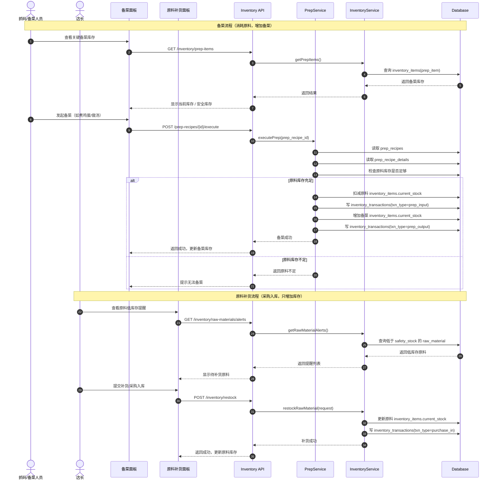

```mermaid
sequenceDiagram
    autonumber

    actor Assembler as 抓码/备菜人员
    actor Manager as 店长
    participant PrepUI as 备菜面板
    participant ManagerUI as 原料补货面板
    participant InventoryAPI as Inventory API
    participant PrepService as PrepService
    participant InventoryService as InventoryService
    participant DB as Database

    Note over Assembler,DB: 备菜流程（消耗原料，增加备菜）

    Assembler->>PrepUI: 查看关键备菜库存
    PrepUI->>InventoryAPI: GET /inventory/prep-items
    InventoryAPI->>InventoryService: getPrepItems()
    InventoryService->>DB: 查询 inventory_items(prep_item)
    DB-->>InventoryService: 返回备菜库存
    InventoryService-->>InventoryAPI: 返回结果
    InventoryAPI-->>PrepUI: 显示当前库存 / 安全库存

    Assembler->>PrepUI: 发起备菜（如煮鸡蛋/做汤）
    PrepUI->>InventoryAPI: POST /prep-recipes/{id}/execute
    InventoryAPI->>PrepService: executePrep(prep_recipe_id)

    PrepService->>DB: 读取 prep_recipes
    PrepService->>DB: 读取 prep_recipe_details
    PrepService->>DB: 检查原料库存是否足够

    alt 原料库存充足
        PrepService->>DB: 扣减原料 inventory_items.current_stock
        PrepService->>DB: 写 inventory_transactions(txn_type=prep_input)
        PrepService->>DB: 增加备菜 inventory_items.current_stock
        PrepService->>DB: 写 inventory_transactions(txn_type=prep_output)
        PrepService-->>InventoryAPI: 备菜成功
        InventoryAPI-->>PrepUI: 返回成功，更新备菜库存
    else 原料库存不足
        PrepService-->>InventoryAPI: 返回原料不足
        InventoryAPI-->>PrepUI: 提示无法备菜
    end

    Note over Manager,DB: 原料补货流程（采购入库，只增加库存）

    Manager->>ManagerUI: 查看原料低库存提醒
    ManagerUI->>InventoryAPI: GET /inventory/raw-materials/alerts
    InventoryAPI->>InventoryService: getRawMaterialAlerts()
    InventoryService->>DB: 查询低于 safety_stock 的 raw_material
    DB-->>InventoryService: 返回低库存原料
    InventoryService-->>InventoryAPI: 返回提醒列表
    InventoryAPI-->>ManagerUI: 显示待补货原料

    Manager->>ManagerUI: 提交补货/采购入库
    ManagerUI->>InventoryAPI: POST /inventory/restock
    InventoryAPI->>InventoryService: restockRawMaterial(request)

    InventoryService->>DB: 更新原料 inventory_items.current_stock
    InventoryService->>DB: 写 inventory_transactions(txn_type=purchase_in)
    InventoryService-->>InventoryAPI: 补货成功
    InventoryAPI-->>ManagerUI: 返回成功，更新原料库存
```