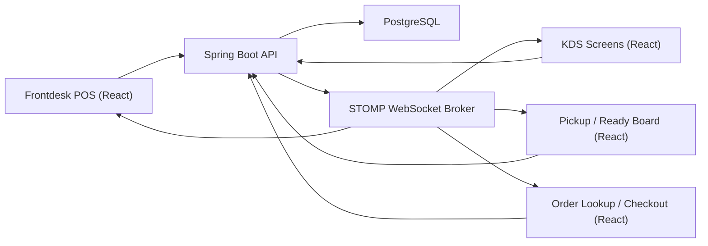
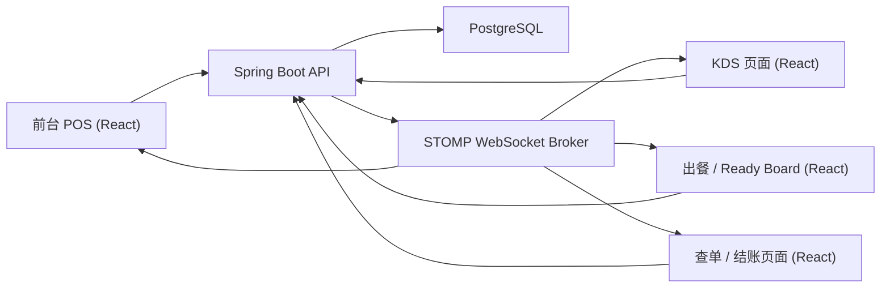

# Restaurant POS + KDS + Inventory System Design

Version: 1.0  
Source of truth: Current codebase and runtime structure in this repository  
Scope: Frontdesk POS, KDS, pass / ready shelf, beverage workflow, unified production task introduction, inventory deduction, store / user / role foundation

---

# English Version

## 1. Document Purpose

This document defines the production-oriented system design for the Restaurant POS + KDS + Inventory platform implemented in this repository. It is intended to help developers understand:

- system boundaries
- module responsibilities
- database structure
- real-time event model
- operational business flows
- migration direction for production task unification

The document reflects the current implemented architecture, including the safe Phase 1 introduction of `production_tasks` and `dining_tables`.

---

## 2. Technology Stack

| Layer | Technology | Notes |
|---|---|---|
| Frontend | React + TypeScript + Vite | Single web frontend for POS, KDS, pickup, and operational screens |
| Backend | Spring Boot 3 | REST APIs, JPA, service orchestration |
| Database | PostgreSQL | Primary transactional store |
| Real-time | WebSocket + STOMP | Event push to frontdesk, KDS, pass, and history screens |
| ORM / DB Access | Spring Data JPA + MyBatis-Plus | JPA is the main runtime model for current operational modules |

---

## 3. System Scope

### 3.1 Core Modules

- Frontdesk ordering
- Menu catalog
- Order management
- Kitchen Display System (KDS)
- Pass / serving shelf
- Frontdesk beverage handling
- Production task model
- Inventory deduction and transaction logging
- User / role / store / station management

### 3.2 Device Model

- Frontdesk runs on iPad / browser workstation
- KDS runs on iPad / monitor browser screens
- Pickup / handoff board runs on browser display
- System is web-first, not native-app-first

---

## 4. High-Level Architecture



### 4.1 Architectural Style

- **Single backend service** coordinates ordering, station tasks, beverage handling, and inventory deduction.
- **Single frontend codebase** renders multiple operational surfaces through route-based views.
- **Database-first transactional design** ensures order submission, task creation, and inventory deduction happen consistently.
- **Event-driven UI refresh** ensures KDS and pickup screens update without manual refresh.

---

## 5. Module Responsibilities

| Module | Responsibility |
|---|---|
| `menu` | Category, item, option master data; store-scoped menu catalog |
| `order` | Draft creation, submit, edit, cancel, complete, frontdesk order board |
| `kitchen` | Station task execution, pass / serving shelf data, KDS display aggregation |
| `production` | Unified operational task record introduced in Phase 1 for kitchen + beverage convergence |
| `inventory` | Ingredient stock, consumption deduction, audit transactions |
| `station` | Station master data and, now, dining table master structure |
| `user` | Store, user, role, assignment foundation |
| `common` | WebSocket, realtime event publishing, error handling, shared infrastructure |

---

## 6. Domain Model Overview

### 6.1 Business Entities

- **Store**: tenant-like business container
- **Role / User**: operational actors
- **Station**: production responsibility unit such as `NOODLE`, `WOK`, `DEEPFRIED`, `COLD`
- **DiningTable**: physical dining seat inventory for frontdesk table management
- **MenuCategory / MenuItem / MenuItemOption**: sellable catalog
- **Order / OrderItem / OrderItemOption**: transactional sales data
- **KitchenTask**: current kitchen work item
- **FrontdeskBeverageItem**: current frontdesk beverage work item
- **ProductionTask**: additive unified production record for future consolidation
- **InventoryItem / InventoryTransaction**: stock and stock movement
- **MenuItemBom / MenuItemOptionBom**: ingredient deduction rules

### 6.2 Operational Separation

Current implementation intentionally separates:

- **sales transaction objects**
  - `orders`
  - `order_items`
  - `order_item_options`

from

- **execution / production objects**
  - `kitchen_tasks`
  - `frontdesk_beverage_items`
  - `production_tasks` (new additive unified model)

This separation is essential because one customer order can fan out into multiple operational tasks across stations.

---

## 7. Database Design

## 7.1 Database Design Principles

1. Preserve submitted transaction history through snapshot fields.
2. Keep operational execution tables separate from commercial sales tables.
3. Model stations explicitly for routing and KDS filtering.
4. Support store-scoped data separation.
5. Introduce unified tasking safely through additive migration, not destructive rewrite.

## 7.2 Database Tables

### 7.2.1 Organization & Access

| Table | Purpose | Key Fields | Foreign Keys | Relationships |
|---|---|---|---|---|
| `stores` | Business unit / store boundary | `id`, `name`, `code`, `status`, `enable_bar_kitchen_tasks` | None | One store owns menu, users, stations, orders, dining tables, inventory |
| `roles` | User role dictionary | `id`, `name`, `code` | None | One role maps to many users |
| `users` | Frontdesk / kitchen / admin staff | `id`, `store_id`, `role_id`, `username`, `full_name`, `phone`, `status` | `store_id -> stores.id`, `role_id -> roles.id` | One user creates many orders and inventory transactions |
| `stations` | Production work centers | `id`, `store_id`, `name`, `code`, `sort_order`, `is_active` | `store_id -> stores.id` | One station routes many menu items and many kitchen tasks |

### 7.2.2 Table Management

| Table | Purpose | Key Fields | Foreign Keys | Relationships |
|---|---|---|---|---|
| `dining_tables` | Physical dining table master used for future normalized table management | `id`, `store_id`, `table_code`, `table_name`, `area_name`, `capacity`, `supports_split`, `is_active` | `store_id -> stores.id` (logical; no enforced DB FK yet) | One store owns many dining tables |

### 7.2.3 Menu Catalog

| Table | Purpose | Key Fields | Foreign Keys | Relationships |
|---|---|---|---|---|
| `menu_categories` | Store-scoped category grouping | `id`, `store_id`, `code`, `name_zh`, `name_en`, `sort_order`, `is_active` | `store_id -> stores.id` | One category contains many menu items |
| `menu_items` | Sellable products | `id`, `store_id`, `category_id`, `station_id`, `sku`, `name_zh`, `name_en`, `item_type`, `base_price`, `is_active`, `is_sold_out` | `store_id -> stores.id`, `category_id -> menu_categories.id`, `station_id -> stations.id` | One menu item has many options and BOM rows |
| `menu_item_options` | Item configuration choices such as size, noodle type, add-ons, remove options, combo selections | `id`, `menu_item_id`, `option_type`, `name_zh`, `name_en`, `price_delta`, `is_active` | `menu_item_id -> menu_items.id` | One item has many option records |

### 7.2.4 Sales Transaction

| Table | Purpose | Key Fields | Foreign Keys | Relationships |
|---|---|---|---|---|
| `orders` | Order header | `id`, `store_id`, `created_by`, `order_no`, `order_type`, `status`, `table_no`, `pickup_no`, `subtotal_amount`, `total_amount`, `submitted_at`, `ready_at`, `completed_at`, `is_modified_after_submit` | `store_id -> stores.id`, `created_by -> users.id` | One order contains many order items |
| `order_items` | Item line under one order | `id`, `order_id`, `menu_item_id`, `category_code_snapshot`, `item_name_snapshot_zh`, `item_name_snapshot_en`, `quantity`, `unit_price`, `line_amount`, `combo_group_no`, `combo_role`, `status`, `notes`, `is_modified_after_submit` | **DB-enforced:** `order_id -> orders.id`; logical `menu_item_id -> menu_items.id` | One order item has many order item options; one order item may create operational tasks |
| `order_item_options` | Option selections attached to one order item | `id`, `order_item_id`, `option_id`, `option_type_snapshot`, `option_name_snapshot_zh`, `option_name_snapshot_en`, `price_delta`, `quantity` | **DB-enforced:** `order_item_id -> order_items.id`; logical `option_id -> menu_item_options.id` | Many selected options belong to one order item |

### 7.2.5 Operational Execution

| Table | Purpose | Key Fields | Foreign Keys | Relationships |
|---|---|---|---|---|
| `kitchen_tasks` | Active station tasks handled by kitchen-side workflows | `id`, `order_id`, `order_item_id`, `store_id`, `station_code`, `item_name_snapshot_zh`, `special_instructions_snapshot`, `status`, `quantity`, `priority`, timestamps | Logical `order_id -> orders.id`, `order_item_id -> order_items.id`, `store_id -> stores.id` | One order can generate many kitchen tasks |
| `frontdesk_beverage_items` | Beverage / direct-serve work handled by frontdesk instead of kitchen | `id`, `order_id`, `order_item_id`, `store_id`, `item_name_snapshot_zh`, `special_instructions_snapshot`, `status`, `quantity`, timestamps | Logical `order_id -> orders.id`, `order_item_id -> order_items.id`, `store_id -> stores.id` | One order can generate many frontdesk beverage tasks |
| `production_tasks` | New additive unified production task table introduced for safe migration; mirrors both kitchen and frontdesk beverage execution records | `id`, `order_id`, `order_item_id`, `store_id`, `source_type`, `source_id`, `station_code`, `item_name_snapshot_zh`, `special_instructions_snapshot`, `status`, `quantity`, timestamps | Logical `order_id -> orders.id`, `order_item_id -> order_items.id`, `store_id -> stores.id` | One production task row references one legacy operational source row |

### 7.2.6 Inventory

| Table | Purpose | Key Fields | Foreign Keys | Relationships |
|---|---|---|---|---|
| `inventory_items` | Raw material / prep stock master | `id`, `store_id`, `name`, `code`, `item_level`, `item_type`, `unit`, `current_stock`, `safety_stock`, `default_prep_batch`, `is_key_item`, `is_active` | `store_id -> stores.id` | Used by BOM and inventory transactions |
| `inventory_transactions` | Immutable stock movement ledger | `id`, `inventory_item_id`, `operated_by`, `txn_type`, `source_type`, `source_id`, `qty_change`, `stock_before`, `stock_after`, `remarks`, `created_at` | `inventory_item_id -> inventory_items.id`, `operated_by -> users.id` | Many transactions belong to one inventory item |
| `menu_item_bom` | Base ingredient deduction rule for a menu item | `id`, `menu_item_id`, `inventory_item_id`, `qty_per_unit` | `menu_item_id -> menu_items.id`, `inventory_item_id -> inventory_items.id` | One menu item may deduct many inventory items |
| `menu_item_option_bom` | Additional ingredient deduction rule contributed by an option | `id`, `menu_item_option_id`, `inventory_item_id`, `qty_per_unit` | `menu_item_option_id -> menu_item_options.id`, `inventory_item_id -> inventory_items.id` | One option may deduct many inventory items |

---

## 8. Key Design Decisions

### 8.1 Why snapshot fields are used

`order_items`, `order_item_options`, `kitchen_tasks`, and `frontdesk_beverage_items` all store snapshot names and option text instead of relying only on live master data.

This is necessary because:

- menu names and options can change after a sale
- kitchen must see the exact wording that was sold at submit time
- receipts, history, KDS, and dispute investigation must remain stable even after menu maintenance

Without snapshots, historical orders would drift when master data changes.

### 8.2 Why combo is not a separate table

Combo is represented through:

- `combo_group_no`
- `combo_role`
- normal `order_items` rows
- normal `order_item_options` rows

This avoids over-modeling in MVP and preserves a simple order-write path. Combo children remain regular order items, so pricing, snapshots, KDS routing, and inventory deduction can reuse the same infrastructure.

### 8.3 Why `production_tasks` is unified

Historically, operational execution was split into:

- `kitchen_tasks`
- `frontdesk_beverage_items`

This makes downstream reporting, station-agnostic monitoring, and future orchestration harder. `production_tasks` is introduced as a unified additive table so the system can gradually converge execution tracking without breaking current screens.

Current production approach:

- old tables remain active
- APIs remain unchanged
- submit flow writes to old tables and also mirrors to `production_tasks`

This is a safe migration bridge.

### 8.4 Why `station_code` is used instead of only dynamic relation joins

`station_code` is stored directly on task rows because station routing must be:

- stable at execution time
- cheap to filter in KDS queries
- resilient even if menu or station master data changes later

KDS screens and pass screens need fast, explicit routing keys. A stored code is more reliable for live operational filtering than recalculating routing dynamically from mutable master records.

### 8.5 Why WebSocket is used

Operational restaurant screens require near real-time updates:

- POS submit should appear on KDS immediately
- kitchen completion should appear on serving shelf immediately
- frontdesk completion should disappear from active screens immediately

Polling alone would introduce lag and unnecessary load. STOMP WebSocket enables event-driven updates while fallback polling remains available in some screens for resilience.

---

## 9. Core Business Flows

## 9.1 Order Lifecycle

### Current implementation flow

`draft -> submitted -> preparing -> ready -> completed`

`picked_up` exists in constants but is not the dominant current frontend lifecycle path.

### Detailed flow

1. Frontdesk creates a draft order.
2. Draft items and selected options are saved.
3. On submit:
   - order status becomes `submitted`
   - operational tasks are generated
   - inventory is deducted
4. If kitchen-side tasks exist:
   - order transitions to `preparing`
5. If no kitchen-side tasks exist:
   - order transitions directly to `ready`
6. When all relevant station tasks become ready:
   - order becomes `ready`
7. Frontdesk finishes / completes the order:
   - order becomes `completed`

## 9.2 Kitchen Task Lifecycle

### Kitchen-side station items

`pending -> in_progress -> ready_for_pickup -> served`

Alternative terminal path:

`pending/in_progress -> cancelled`

### Operational meaning

- `pending`: created but not started
- `in_progress`: station is working on it
- `ready_for_pickup`: item is finished by station and ready for pass / serving shelf
- `served`: item was handed off / served downstream
- `cancelled`: task invalidated due to order cancellation or item removal

## 9.3 Beverage Handling Flow

Frontdesk beverage items use a parallel but separate lifecycle:

`pending -> preparing -> ready -> served`

Alternative terminal path:

`pending/preparing -> cancelled`

This separation exists because beverage/direct-serve work is not always executed through kitchen KDS.

## 9.4 KDS Display Logic by `station_code`

Current operational interpretation:

| Station Code | Screen / Responsibility |
|---|---|
| `NOODLE` | Ramen / noodle station monitoring and assembling-relevant noodle tasks |
| `WOK` | Hot kitchen and assembling views for wok / fried noodle production |
| `DEEPFRIED` | Hot kitchen and assembling views for fried items |
| `COLD` | Side / cold-prep items shown in assembling workflow |
| `FRONTDESK_BEVERAGE` | Phase 1 unified production identifier for frontdesk beverage tasks |

Important note:

- current KDS APIs still primarily read legacy operational tables
- `production_tasks` is currently additive and not yet the sole KDS read model

## 9.5 Order Modification After Submission

Current system supports post-submit modification for active orders.

Behavior:

1. An order in `submitted`, `preparing`, or `ready` can still be edited.
2. The order is marked with:
   - `is_modified_after_submit = true`
   - `modified_after_submit_at`
3. Affected operational records are synchronized or recreated as needed.
4. KDS / pass / ready board receive realtime update events.
5. The same order ID remains in use; the system does not create a second “updated order”.

This is important for restaurant operations where tables often add or remove items after initial submit.

---

## 10. Submit Order Processing

Current backend submit sequence in `OrderServiceImpl#submitOrder`:

1. Validate order status is `draft`
2. Validate at least one order item exists
3. Load order item options
4. Mark order `submitted`
5. Generate `kitchen_tasks` for station-routed items
6. Generate `frontdesk_beverage_items` for direct-serve beverage items
7. Mirror both into `production_tasks`
8. Deduct inventory using:
   - `menu_item_bom`
   - `menu_item_option_bom`
9. Insert `inventory_transactions`
10. Finalize order state:
   - `preparing` if kitchen tasks exist
   - `ready` if no kitchen tasks exist
11. Publish realtime events

---

## 11. Realtime Event Design

## 11.1 WebSocket Transport

- Endpoint: `/ws`
- Broker prefix: `/topic`
- Topic namespace pattern:

```text
/topic/stores/{store_id}/{topic_suffix}
```

## 11.2 Topic List

| Topic | Full Form | Purpose |
|---|---|---|
| `frontdesk/orders` | `/topic/stores/{store_id}/frontdesk/orders` | Frontdesk order board refresh, table occupancy, order status changes |
| `frontdesk/beverages` | `/topic/stores/{store_id}/frontdesk/beverages` | Frontdesk beverage board updates |
| `kds/noodle-display` | `/topic/stores/{store_id}/kds/noodle-display` | Noodle / ramen / assembling KDS updates |
| `kds/hot-kitchen` | `/topic/stores/{store_id}/kds/hot-kitchen` | Hot kitchen KDS updates |
| `kds/pass` | `/topic/stores/{store_id}/kds/pass` | Pass / assembling-related operational updates |
| `kds/serving-shelf` | `/topic/stores/{store_id}/kds/serving-shelf` | Ready board / handoff board updates |
| `history` | `/topic/stores/{store_id}/history` | History screens, completed/cancelled lifecycle updates |

## 11.3 Event Publishing Responsibilities

### Order events
Published by `OrderServiceImpl` to:

- `frontdesk/orders`
- `frontdesk/beverages`
- `kds/noodle-display`
- `kds/hot-kitchen`
- `kds/pass`
- `kds/serving-shelf`
- `history`

Typical event types:

- `order.created`
- `order.submitted`
- `order.ready`
- `order.modified_after_submit`
- `order.completed`
- `order.cancelled`

### Kitchen task events
Published by `KitchenServiceImpl` to:

- `frontdesk/orders`
- `kds/noodle-display`
- `kds/hot-kitchen`
- `kds/pass`
- `kds/serving-shelf`
- `history`

Typical event types:

- `kitchen_task.started`
- `kitchen_task.ready_for_pickup`
- `kitchen_task.served`

### Beverage events
Published by `FrontdeskBeverageServiceImpl` to:

- `frontdesk/orders`
- `frontdesk/beverages`
- `history`

Typical event types:

- `beverage_item.started`
- `beverage_item.ready`
- `beverage_item.served`
- `beverage_item.cancelled`

---

## 12. Station-Specific Screen Model

| Screen | Primary Data | Interaction Type |
|---|---|---|
| Frontdesk POS | orders + menu catalog | create / edit / submit / finish |
| Assembling / Grab | kitchen tasks across `NOODLE`, `WOK`, `DEEPFRIED`, `COLD` | action screen |
| Ramen station | noodle-relevant active tasks only | display-only |
| Hot Kitchen | `WOK` + `DEEPFRIED` active tasks | action screen |
| Pickup / Ready Board | only `READY_FOR_PICKUP` items not yet served, excluding delivery | action screen |
| Order Lookup / Checkout | orders + order detail | lookup / split bill / complete |

---

## 13. Multi-Store Support

The system already carries multi-store structure at the data model layer:

- `stores`
- `users.store_id`
- `stations.store_id`
- `menu_categories.store_id`
- `menu_items.store_id`
- `orders.store_id`
- `inventory_items.store_id`
- `dining_tables.store_id`
- `production_tasks.store_id`

Current operational UI flows often run with `store_id = 1` in seeded local development, but the schema and service contracts are already store-scoped.

---

## 14. Extension Guidance

Recommended next safe evolution steps:

1. Migrate KDS read models gradually from:
   - `kitchen_tasks`
   - `frontdesk_beverage_items`
   to:
   - `production_tasks`
2. Start populating and reading normalized `dining_tables`
3. Add explicit FK constraints for other tables only after validating existing data
4. Introduce payment records and bill settlement entities separately from order completion
5. Keep snapshot strategy intact even after future normalization

---

# 中文版本

## 1. 文档目的

本文档用于定义本仓库当前实现的餐厅 POS + KDS + 库存系统的正式系统设计，帮助开发者理解：

- 系统边界
- 模块职责
- 数据库结构
- 实时事件模型
- 核心业务流程
- `production_tasks` 统一任务模型的迁移方向

本文档基于当前代码与运行结构编写，包含已安全引入的 `production_tasks` 与 `dining_tables`。

---

## 2. 技术栈

| 层级 | 技术 | 说明 |
|---|---|---|
| 前端 | React + TypeScript + Vite | 统一承载前台 POS、KDS、出餐台、查单与结账页面 |
| 后端 | Spring Boot 3 | 提供 REST API、事务处理、任务编排 |
| 数据库 | PostgreSQL | 核心事务数据存储 |
| 实时通信 | WebSocket + STOMP | 前台、后厨、出餐台的实时更新 |
| 数据访问 | Spring Data JPA + MyBatis-Plus | 当前运行中的核心业务主要基于 JPA |

---

## 3. 系统范围

### 3.1 核心模块

- 前台点单
- 菜单系统
- 订单系统
- 厨房显示系统（KDS）
- Pass / 出餐台
- 饮品处理（前台自处理）
- 生产任务统一模型
- 库存扣减与库存流水
- 用户 / 角色 / 门店 / 工位基础模块

### 3.2 设备形态

- 前台主要运行在 iPad / 浏览器工作台
- KDS 运行在 iPad / 大屏浏览器
- Ready / Pickup Board 运行在浏览器显示屏
- 整体是 Web-first，而不是 Native App-first

---

## 4. 高层架构



### 4.1 架构特征

- **单体后端服务**：统一负责点单、生产任务、饮品处理、库存扣减。
- **单前端代码库**：通过路由切换不同业务界面。
- **以数据库事务为核心**：确保提交订单、生成任务、扣减库存的一致性。
- **事件驱动界面刷新**：KDS、出餐台、前台状态不依赖手动刷新。

---

## 5. 模块职责

| 模块 | 职责 |
|---|---|
| `menu` | 分类、菜品、选项主数据；按门店输出菜单目录 |
| `order` | 草稿单、提交、改单、取消、完成、前台订单板 |
| `kitchen` | 厨房任务执行、pass/serving shelf 数据、KDS 聚合显示 |
| `production` | Phase 1 新引入的统一生产任务表，用于逐步合并厨房任务与前台饮品任务 |
| `inventory` | 原料库存、扣减、流水审计 |
| `station` | 工位主数据，以及新的堂食桌位主数据结构 |
| `user` | 门店、用户、角色等基础数据 |
| `common` | WebSocket、实时事件发布、异常处理、通用基础设施 |

---

## 6. 领域模型概览

### 6.1 核心业务实体

- **Store**：门店边界
- **Role / User**：系统操作人员
- **Station**：生产责任工位，例如 `NOODLE`、`WOK`、`DEEPFRIED`、`COLD`
- **DiningTable**：前台桌位主数据
- **MenuCategory / MenuItem / MenuItemOption**：菜单销售主数据
- **Order / OrderItem / OrderItemOption**：订单交易数据
- **KitchenTask**：厨房执行任务
- **FrontdeskBeverageItem**：前台自处理饮品任务
- **ProductionTask**：新引入的统一生产任务记录
- **InventoryItem / InventoryTransaction**：库存与库存流水
- **MenuItemBom / MenuItemOptionBom**：库存扣减规则

### 6.2 交易与执行分离

当前系统有意将：

- **销售交易对象**
  - `orders`
  - `order_items`
  - `order_item_options`

与

- **执行任务对象**
  - `kitchen_tasks`
  - `frontdesk_beverage_items`
  - `production_tasks`

分开建模。

原因是：
- 一张订单可以拆分成多个工位任务
- 同一个订单明细可能进入不同生产链路
- 交易数据和执行状态的生命周期不同

---

## 7. 数据库设计

## 7.1 设计原则

1. 通过 snapshot 字段保证历史订单内容不漂移。
2. 执行任务表与销售交易表分离。
3. 使用明确的 station 路由工位执行。
4. 所有核心业务数据按 store 维度隔离。
5. 用“只增加、不破坏”的方式推进统一任务模型迁移。

## 7.2 数据表说明

### 7.2.1 组织与权限

| 表名 | 作用 | 关键字段 | 外键 | 关系说明 |
|---|---|---|---|---|
| `stores` | 门店主数据 | `id`, `name`, `code`, `status`, `enable_bar_kitchen_tasks` | 无 | 一个门店拥有菜单、用户、工位、订单、库存、桌位 |
| `roles` | 角色字典 | `id`, `name`, `code` | 无 | 一个角色可分配给多个用户 |
| `users` | 前台 / 后厨 / 管理人员 | `id`, `store_id`, `role_id`, `username`, `full_name`, `phone`, `status` | `store_id -> stores.id`, `role_id -> roles.id` | 一个用户可创建多张订单、产生多条库存流水 |
| `stations` | 生产工位主数据 | `id`, `store_id`, `name`, `code`, `sort_order`, `is_active` | `store_id -> stores.id` | 一个工位可关联多个菜品，也可承接多条厨房任务 |

### 7.2.2 桌位管理

| 表名 | 作用 | 关键字段 | 外键 | 关系说明 |
|---|---|---|---|---|
| `dining_tables` | 堂食桌位主数据，为后续桌位系统标准化做准备 | `id`, `store_id`, `table_code`, `table_name`, `area_name`, `capacity`, `supports_split`, `is_active` | `store_id -> stores.id`（逻辑关系，当前未强制 FK） | 一个门店拥有多张桌位 |

### 7.2.3 菜单目录

| 表名 | 作用 | 关键字段 | 外键 | 关系说明 |
|---|---|---|---|---|
| `menu_categories` | 门店维度下的菜单分类 | `id`, `store_id`, `code`, `name_zh`, `name_en`, `sort_order`, `is_active` | `store_id -> stores.id` | 一个分类下有多个菜品 |
| `menu_items` | 可售卖菜品 | `id`, `store_id`, `category_id`, `station_id`, `sku`, `name_zh`, `name_en`, `item_type`, `base_price`, `is_active`, `is_sold_out` | `store_id -> stores.id`, `category_id -> menu_categories.id`, `station_id -> stations.id` | 一个菜品可拥有多个 option 与 BOM 行 |
| `menu_item_options` | 菜品配置项，如规格、面型、辣度、加料、去料、套餐项 | `id`, `menu_item_id`, `option_type`, `name_zh`, `name_en`, `price_delta`, `is_active` | `menu_item_id -> menu_items.id` | 一个菜品对应多个可选项 |

### 7.2.4 销售交易

| 表名 | 作用 | 关键字段 | 外键 | 关系说明 |
|---|---|---|---|---|
| `orders` | 订单头 | `id`, `store_id`, `created_by`, `order_no`, `order_type`, `status`, `table_no`, `pickup_no`, `subtotal_amount`, `total_amount`, `submitted_at`, `ready_at`, `completed_at`, `is_modified_after_submit` | `store_id -> stores.id`, `created_by -> users.id` | 一张订单包含多条订单明细 |
| `order_items` | 订单行项目 | `id`, `order_id`, `menu_item_id`, `category_code_snapshot`, `item_name_snapshot_zh`, `item_name_snapshot_en`, `quantity`, `unit_price`, `line_amount`, `combo_group_no`, `combo_role`, `status`, `notes`, `is_modified_after_submit` | **已落库 FK：** `order_id -> orders.id`；逻辑上 `menu_item_id -> menu_items.id` | 一条订单明细可带多个 option，也可能拆出多个执行任务 |
| `order_item_options` | 订单行的 option 选择 | `id`, `order_item_id`, `option_id`, `option_type_snapshot`, `option_name_snapshot_zh`, `option_name_snapshot_en`, `price_delta`, `quantity` | **已落库 FK：** `order_item_id -> order_items.id`；逻辑上 `option_id -> menu_item_options.id` | 多个 option 归属于一个订单行 |

### 7.2.5 执行任务

| 表名 | 作用 | 关键字段 | 外键 | 关系说明 |
|---|---|---|---|---|
| `kitchen_tasks` | 厨房执行任务表 | `id`, `order_id`, `order_item_id`, `store_id`, `station_code`, `item_name_snapshot_zh`, `special_instructions_snapshot`, `status`, `quantity`, `priority`, 时间戳字段 | 逻辑上 `order_id -> orders.id`, `order_item_id -> order_items.id`, `store_id -> stores.id` | 一张订单可生成多条厨房任务 |
| `frontdesk_beverage_items` | 前台自处理饮品任务表 | `id`, `order_id`, `order_item_id`, `store_id`, `item_name_snapshot_zh`, `special_instructions_snapshot`, `status`, `quantity`, 时间戳字段 | 逻辑上 `order_id -> orders.id`, `order_item_id -> order_items.id`, `store_id -> stores.id` | 一张订单可生成多条前台饮品任务 |
| `production_tasks` | Phase 1 新增的统一生产任务表，用于安全承接厨房任务与前台饮品任务 | `id`, `order_id`, `order_item_id`, `store_id`, `source_type`, `source_id`, `station_code`, `item_name_snapshot_zh`, `special_instructions_snapshot`, `status`, `quantity`, 时间戳字段 | 逻辑上 `order_id -> orders.id`, `order_item_id -> order_items.id`, `store_id -> stores.id` | 一条 production task 对应一条旧执行来源记录 |

### 7.2.6 库存

| 表名 | 作用 | 关键字段 | 外键 | 关系说明 |
|---|---|---|---|---|
| `inventory_items` | 原料 / 备料库存主数据 | `id`, `store_id`, `name`, `code`, `item_level`, `item_type`, `unit`, `current_stock`, `safety_stock`, `default_prep_batch`, `is_key_item`, `is_active` | `store_id -> stores.id` | 被 BOM 与库存流水引用 |
| `inventory_transactions` | 库存流水账本 | `id`, `inventory_item_id`, `operated_by`, `txn_type`, `source_type`, `source_id`, `qty_change`, `stock_before`, `stock_after`, `remarks`, `created_at` | `inventory_item_id -> inventory_items.id`, `operated_by -> users.id` | 一种库存项可对应多条流水 |
| `menu_item_bom` | 菜品基础扣料规则 | `id`, `menu_item_id`, `inventory_item_id`, `qty_per_unit` | `menu_item_id -> menu_items.id`, `inventory_item_id -> inventory_items.id` | 一个菜品可扣减多种原料 |
| `menu_item_option_bom` | option 附加扣料规则 | `id`, `menu_item_option_id`, `inventory_item_id`, `qty_per_unit` | `menu_item_option_id -> menu_item_options.id`, `inventory_item_id -> inventory_items.id` | 一个 option 可额外扣减多种原料 |

---

## 8. 关键设计决策

### 8.1 为什么使用 snapshot 字段

`order_items`、`order_item_options`、`kitchen_tasks`、`frontdesk_beverage_items` 都保存了中英双语快照，而不是只引用菜单主数据。

原因：

- 菜单名称和 option 可能会在售卖后发生变更
- 后厨需要看到提交当时的准确文案
- 小票、历史、纠纷追溯都必须保持稳定

如果不做快照，历史订单会随着菜单修改而被污染。

### 8.2 为什么 combo 不拆成单独表

当前 combo 通过以下字段与普通订单结构复用：

- `combo_group_no`
- `combo_role`
- 普通 `order_items`
- 普通 `order_item_options`

这样做的好处是：

- MVP 阶段写单逻辑更简单
- 定价、抓码、KDS 路由、库存扣减都可以复用现有基础设施
- combo 子项仍然是正常订单行，便于统一处理

### 8.3 为什么引入统一的 `production_tasks`

历史上执行任务被拆分成：

- `kitchen_tasks`
- `frontdesk_beverage_items`

这会让后续的：

- 统一报表
- 跨工位监控
- 统一执行追踪

变得复杂。

因此 Phase 1 先以“只增加”的方式引入 `production_tasks`：

- 老表继续写
- 现有 API 不变
- 提交订单时同时镜像写入 `production_tasks`

这是一种安全迁移桥接方案。

### 8.4 为什么使用 `station_code` 而不是只依赖动态关系

任务行直接保存 `station_code`，原因是工位路由必须：

- 在执行时稳定
- 在 KDS 查询中高效过滤
- 不受后续菜单或工位主数据变更影响

对于实时 KDS 来说，存储型路由码比运行时动态推导更可靠。

### 8.5 为什么使用 WebSocket

餐厅运营屏幕要求接近实时更新：

- 前台提交订单后，KDS 需要立即出现
- 后厨完成后，Ready Board 需要立即显示
- 前台完成订单后，活跃屏幕要立即消失

仅靠轮询会带来明显延迟和额外负载，因此采用 STOMP WebSocket 作为主更新机制，部分页面再辅以轮询兜底。

---

## 9. 核心业务流程

## 9.1 订单生命周期

### 当前实现中的主流程

`draft -> submitted -> preparing -> ready -> completed`

代码中存在 `picked_up` 常量，但当前前端主流程并未把它作为主要终态路径。

### 详细步骤

1. 前台创建草稿单。
2. 保存订单行与 option。
3. 提交后：
   - 订单状态先变成 `submitted`
   - 生成执行任务
   - 扣减库存
4. 如果存在厨房任务：
   - 订单变成 `preparing`
5. 如果不存在厨房任务：
   - 订单直接变成 `ready`
6. 当相关工位任务都完成到可出餐状态：
   - 订单进入 `ready`
7. 前台 Finish / Complete：
   - 订单进入 `completed`

## 9.2 厨房任务生命周期

### 厨房执行任务

`pending -> in_progress -> ready_for_pickup -> served`

异常终态：

`pending/in_progress -> cancelled`

### 状态含义

- `pending`：已生成，未开做
- `in_progress`：正在制作
- `ready_for_pickup`：该工位已做好，等待出餐/交接
- `served`：下游已经完成交接
- `cancelled`：订单取消或该行被删除

## 9.3 饮品处理流程

前台饮品独立使用如下状态流：

`pending -> preparing -> ready -> served`

异常终态：

`pending/preparing -> cancelled`

原因是饮品 / 直接出品项目并不一定经过厨房 KDS。

## 9.4 基于 `station_code` 的 KDS 显示逻辑

当前系统的工位语义如下：

| 工位码 | 页面 / 责任 |
|---|---|
| `NOODLE` | 拉面工位只读屏，以及抓码页中的面档任务 |
| `WOK` | Hot Kitchen 与抓码页中的炒锅 / 炒面任务 |
| `DEEPFRIED` | Hot Kitchen 与抓码页中的炸物任务 |
| `COLD` | 抓码页中的小菜 / 凉菜任务 |
| `FRONTDESK_BEVERAGE` | Phase 1 统一任务表中用于表示前台饮品任务的工位标识 |

重要说明：

- 当前 KDS API 主要仍基于老执行表读取
- `production_tasks` 现在是新增镜像层，还不是唯一读模型

## 9.5 提交后的改单逻辑

当前系统支持对已提交但仍活跃的订单继续修改。

行为如下：

1. 处于 `submitted`、`preparing`、`ready` 的订单仍可编辑
2. 订单会被标记：
   - `is_modified_after_submit = true`
   - `modified_after_submit_at`
3. 对应执行任务会同步更新或重新生成
4. KDS / pass / ready board 会收到实时更新
5. 始终复用同一个 order ID，不会创建第二张“更新单”

这符合餐厅实际场景：客人提交后仍可能加菜、退菜或改单。

---

## 10. 提交订单处理链路

当前 `OrderServiceImpl#submitOrder` 的执行顺序：

1. 校验订单当前状态必须为 `draft`
2. 校验订单至少有一条明细
3. 加载订单明细选项
4. 将订单状态更新为 `submitted`
5. 为厨房工位项目生成 `kitchen_tasks`
6. 为前台自处理饮品生成 `frontdesk_beverage_items`
7. 同步镜像写入 `production_tasks`
8. 基于：
   - `menu_item_bom`
   - `menu_item_option_bom`
   扣减库存
9. 写入 `inventory_transactions`
10. 最终决定订单状态：
   - 有厨房任务则为 `preparing`
   - 无厨房任务则直接为 `ready`
11. 发布实时事件

---

## 11. 实时事件设计

## 11.1 WebSocket 传输

- 连接端点：`/ws`
- Broker 前缀：`/topic`
- Topic 命名模式：

```text
/topic/stores/{store_id}/{topic_suffix}
```

## 11.2 Topic 列表

| Topic | 完整地址 | 用途 |
|---|---|---|
| `frontdesk/orders` | `/topic/stores/{store_id}/frontdesk/orders` | 前台订单板、桌台占用、订单状态变化 |
| `frontdesk/beverages` | `/topic/stores/{store_id}/frontdesk/beverages` | 前台饮品看板 |
| `kds/noodle-display` | `/topic/stores/{store_id}/kds/noodle-display` | 拉面/抓码相关 KDS 更新 |
| `kds/hot-kitchen` | `/topic/stores/{store_id}/kds/hot-kitchen` | 热厨 KDS 更新 |
| `kds/pass` | `/topic/stores/{store_id}/kds/pass` | 抓码/Pass 相关更新 |
| `kds/serving-shelf` | `/topic/stores/{store_id}/kds/serving-shelf` | Ready Board / 出餐交接板更新 |
| `history` | `/topic/stores/{store_id}/history` | 历史页、完成/取消状态更新 |

## 11.3 事件发布职责

### 订单事件
由 `OrderServiceImpl` 发布到：

- `frontdesk/orders`
- `frontdesk/beverages`
- `kds/noodle-display`
- `kds/hot-kitchen`
- `kds/pass`
- `kds/serving-shelf`
- `history`

常见事件类型：

- `order.created`
- `order.submitted`
- `order.ready`
- `order.modified_after_submit`
- `order.completed`
- `order.cancelled`

### 厨房任务事件
由 `KitchenServiceImpl` 发布到：

- `frontdesk/orders`
- `kds/noodle-display`
- `kds/hot-kitchen`
- `kds/pass`
- `kds/serving-shelf`
- `history`

常见事件类型：

- `kitchen_task.started`
- `kitchen_task.ready_for_pickup`
- `kitchen_task.served`

### 饮品事件
由 `FrontdeskBeverageServiceImpl` 发布到：

- `frontdesk/orders`
- `frontdesk/beverages`
- `history`

常见事件类型：

- `beverage_item.started`
- `beverage_item.ready`
- `beverage_item.served`
- `beverage_item.cancelled`

---

## 12. 工位页面模型

| 页面 | 主要数据来源 | 交互类型 |
|---|---|---|
| Frontdesk POS | orders + menu catalog | 创建 / 编辑 / 提交 / 完成 |
| Grab / Assembling | `NOODLE`、`WOK`、`DEEPFRIED`、`COLD` 相关任务 | 可操作 |
| Ramen Station | 面档相关任务 | 只读监视 |
| Hot Kitchen | `WOK` + `DEEPFRIED` 任务 | 可操作 |
| Pickup / Ready Board | `READY_FOR_PICKUP` 且未 served 的项目（排除 delivery） | 可操作 |
| Order Lookup / Checkout | 订单列表 + 订单详情 | 查单 / 分账 / 完成 |

---

## 13. 多门店支持

系统在数据模型层已经具备多门店结构：

- `stores`
- `users.store_id`
- `stations.store_id`
- `menu_categories.store_id`
- `menu_items.store_id`
- `orders.store_id`
- `inventory_items.store_id`
- `dining_tables.store_id`
- `production_tasks.store_id`

虽然当前本地开发和 seed 数据大多以 `store_id = 1` 为主，但 schema 和服务接口本身已经按门店维度设计。

---

## 14. 后续演进建议

推荐的安全演进步骤：

1. 逐步将 KDS 读模型从：
   - `kitchen_tasks`
   - `frontdesk_beverage_items`
   迁移到：
   - `production_tasks`
2. 开始真正填充并读取 `dining_tables`
3. 仅在旧数据完全可控后，再逐步补充更多真实外键约束
4. 支付与结账记录应独立建模，不要直接混入订单完成逻辑
5. 后续做结构归一化时，仍然保留 snapshot 策略

