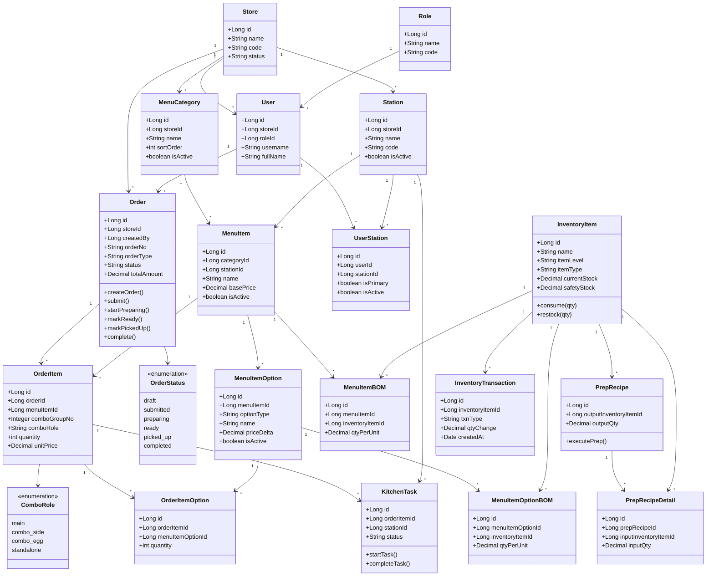

```mermaid
classDiagram
    class Store {
        +Long id
        +String name
        +String code
        +String status
    }

    class Role {
        +Long id
        +String name
        +String code
    }

    class User {
        +Long id
        +Long storeId
        +Long roleId
        +String username
        +String fullName
    }

    class MenuCategory {
        +Long id
        +Long storeId
        +String name
        +int sortOrder
        +boolean isActive
    }

    class MenuItem {
        +Long id
        +Long categoryId
        +Long stationId
        +String name
        +Decimal basePrice
        +boolean isActive
    }

    class MenuItemOption {
        +Long id
        +Long menuItemId
        +String optionType
        +String name
        +Decimal priceDelta
        +boolean isActive
    }

    class Order {
        +Long id
        +Long storeId
        +Long createdBy
        +String orderNo
        +String orderType
        +String status
        +Decimal totalAmount
        +createOrder()
        +submit()
        +startPreparing()
        +markReady()
        +markPickedUp()
        +complete()
    }

    class OrderStatus {
        <<enumeration>>
        draft
        submitted
        preparing
        ready
        picked_up
        completed
    }

    class OrderItem {
        +Long id
        +Long orderId
        +Long menuItemId
        +Integer comboGroupNo
        +String comboRole
        +int quantity
        +Decimal unitPrice
    }

    class OrderItemOption {
        +Long id
        +Long orderItemId
        +Long menuItemOptionId
        +int quantity
    }

    class Station {
        +Long id
        +Long storeId
        +String name
        +String code
        +boolean isActive
    }

    class UserStation {
        +Long id
        +Long userId
        +Long stationId
        +boolean isPrimary
        +boolean isActive
    }

    class KitchenTask {
        +Long id
        +Long orderItemId
        +Long stationId
        +String status
        +startTask()
        +completeTask()
    }

    class InventoryItem {
        +Long id
        +String name
        +String itemLevel
        +String itemType
        +Decimal currentStock
        +Decimal safetyStock
        +consume(qty)
        +restock(qty)
    }

    class MenuItemBOM {
        +Long id
        +Long menuItemId
        +Long inventoryItemId
        +Decimal qtyPerUnit
    }

    class MenuItemOptionBOM {
        +Long id
        +Long menuItemOptionId
        +Long inventoryItemId
        +Decimal qtyPerUnit
    }

    class PrepRecipe {
        +Long id
        +Long outputInventoryItemId
        +Decimal outputQty
        +executePrep()
    }

    class PrepRecipeDetail {
        +Long id
        +Long prepRecipeId
        +Long inputInventoryItemId
        +Decimal inputQty
    }

    class InventoryTransaction {
        +Long id
        +Long inventoryItemId
        +String txnType
        +Decimal qtyChange
        +Date createdAt
    }

    class ComboRole {
        <<enumeration>>
        main
        combo_side
        combo_egg
        standalone
    }

    Store "1" --> "*" User
    Role "1" --> "*" User

    Store "1" --> "*" MenuCategory
    MenuCategory "1" --> "*" MenuItem
    MenuItem "1" --> "*" MenuItemOption

    Store "1" --> "*" Order
    User "1" --> "*" Order
    Order --> OrderStatus
    Order "1" --> "*" OrderItem
    OrderItem --> ComboRole
    MenuItem "1" --> "*" OrderItem
    Station "1" --> "*" MenuItem
    OrderItem "1" --> "*" OrderItemOption
    MenuItemOption "1" --> "*" OrderItemOption

    Store "1" --> "*" Station
    User "1" --> "*" UserStation
    Station "1" --> "*" UserStation

    OrderItem "1" --> "*" KitchenTask
    Station "1" --> "*" KitchenTask

    MenuItem "1" --> "*" MenuItemBOM
    InventoryItem "1" --> "*" MenuItemBOM

    MenuItemOption "1" --> "*" MenuItemOptionBOM
    InventoryItem "1" --> "*" MenuItemOptionBOM

    PrepRecipe "1" --> "*" PrepRecipeDetail
    InventoryItem "1" --> "*" PrepRecipeDetail
    InventoryItem "1" --> "*" InventoryTransaction
    InventoryItem "1" --> "*" PrepRecipe
```
