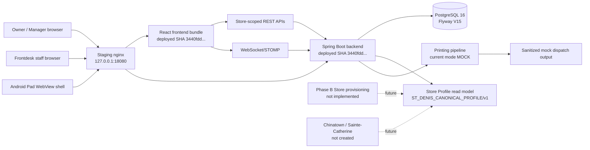

# 01 System Context

## Purpose

This diagram shows the current Staging system boundary and the external actors
or runtime components that interact with it.

## Current runtime/source SHA

- Repository source SHA: `5f4504d23135655f63d564301f8e98f3218347b2`
- Deployed Staging SHA: `3440fddad7571409c66189e44976658921e5de1f`
- Staging Flyway: `V15`

## Scope

Current Staging web application, backend, database, WebSocket path, Store
Profile read path, Android Pad shell, and MOCK printing path.

## Mermaid diagram

## Key invariants

- Staging is a separate runtime under `/srv/restaurant-pos/staging`.
- Current Staging Store is `STG005_SRC_20260809_R01` in Organization `1`.
- Staging Printing is `MOCK`, not `REAL` or `PAD_DIRECT`.
- The A5 profile exists as a reviewed template; it does not materialize a live
  Store in current runtime.
- Production is outside this diagram and was not queried or mutated for this
  baseline.

## What omitted

- physical printer endpoints and credentials
- device tokens and pairing material
- customer PII, historical orders, payments, and secrets
- Phase B/C Store creation behavior

## Source files used

- `deployment/cloud/docker-compose.staging.yml`
- `deployment/cloud/README_STAGING.md`
- `docs/governance/runtime/PHASE_A5_ST_DENIS_CANONICAL_PROFILE_STAGING_EVIDENCE.md`
- `frontend/src/App.tsx`
- `backend/src/main/java/com/restaurant/system/common/config/WebSocketConfig.java`
- `backend/src/main/java/com/restaurant/system/owner/profile/StoreProfileController.java`
- `backend/src/main/java/com/restaurant/system/printing/service/impl/PrintDispatcherServiceImpl.java`

## Last verified date

2026-08-14.
