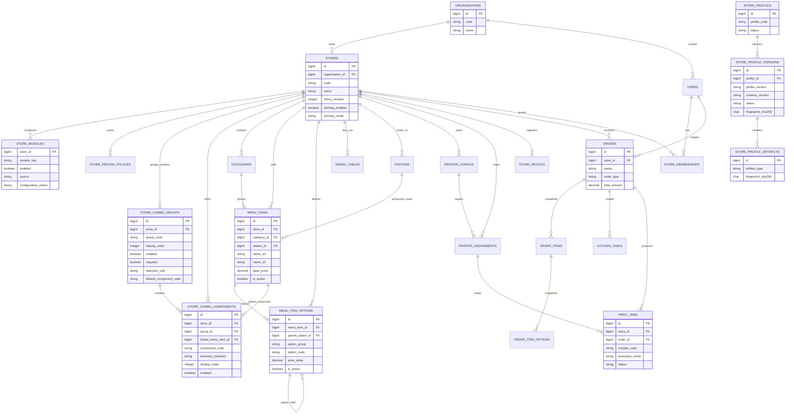

# 02 Domain Model

## Purpose

This diagram records the current Store-scoped domain objects that matter for
Phase A architecture: Store identity, modules, profile templates, menu,
ordering, tables, staff access, and printing.

## Current runtime/source SHA

- Original A5.6 baseline source/deploy SHA:
  `923346f15757ca85fdafb509a803e87f04ae55bd`
- A6 merged source authority before A7:
  `ae144e91a7900f0a541446e93c0f498f41f670c0`
- A7 source authority:
  this package/PR; exact merged main SHA and deployed Staging SHA are recorded
  by the post-merge exact-SHA Staging deployment evidence/final report.
- Staging Flyway: `V16`

## Scope

Current schema and code relationships only. Store Profile tables are templates;
they are not live Store clones.

## Mermaid diagram

## Key invariants

- Live ordering uses submitted order snapshots; historical orders are not
  repriced when menu or pricing policies change.
- `store_pricing_policies` is the canonical Store-level Size/Combo pricing
  source.
- `store_combo_groups` and `store_combo_components` are the canonical
  Store-level Combo contents source.
- `menu_item_options` remains the per-item Size/Combo enablement and ordinary
  option graph.
- `store_modules` is the canonical Store module state; A6 backend gating and
  A7 frontend route/page/navigation gating consume it after authenticated
  Store Context / Store access.
- Store Profile records are DB-backed templates and must not contain source DB
  IDs, secrets, PII, physical printer endpoints, or device credentials.

## What omitted

- low-level audit log tables
- inventory/BOM relationships not central to current Phase A profile/module
  baseline
- raw authentication token storage details
- physical printer endpoint data

## Source files used

- `backend/src/main/resources/db/migration/V11__add_store_pricing_policies.sql`
- `backend/src/main/resources/db/migration/V12__add_store_combo_components.sql`
- `backend/src/main/resources/db/migration/V13__add_store_modules.sql`
- `backend/src/main/resources/db/migration/V14__add_store_profiles.sql`
- `backend/src/main/resources/db/migration/V15__seed_st_denis_canonical_profile.sql`
- `backend/src/main/resources/db/migration/V16__add_dynamic_menu_management_configuration.sql`
- `backend/src/main/java/com/restaurant/system/menu/service/impl/MenuServiceImpl.java`
- `backend/src/main/java/com/restaurant/system/order/service/impl/OrderServiceImpl.java`
- `backend/src/main/java/com/restaurant/system/modules/StoreModuleServiceImpl.java`
- `backend/src/main/java/com/restaurant/system/owner/profile/StoreProfileContractValidator.java`
- `backend/src/main/java/com/restaurant/system/printing/entity/PrintJob.java`

## Last verified date

2026-08-14.
