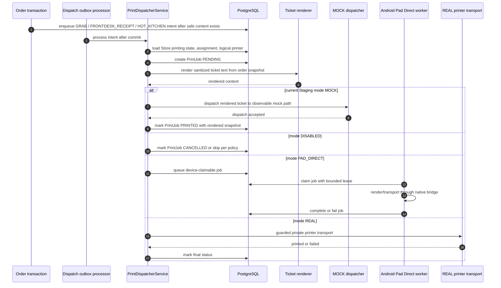

# 05 Printing Sequence

> A9 update: persisted `stores.printing_mode` is the canonical runtime mode.
> Blank, null or unknown persisted values resolve fail-closed to `DISABLED`
> instead of legacy `REAL`; explicit mode mutations must normalize to an
> allowed runtime mode.

> A8 update: Printing is layered as Store module `PRINTING`, logical
> capabilities `PRINT_GRAB`, `PRINT_FRONTDESK_RECEIPT`, `PRINT_HOT_KITCHEN`,
> runtime mode `DISABLED/MOCK/PAD_DIRECT/REAL`, and separate physical binding.
> MOCK uses the full routing/render/job pipeline but does not require or contact
> physical printer endpoints.

## Purpose

This sequence records the current printing architecture and its mode branches,
with current Staging explicitly set to `MOCK`.

## Current runtime/source SHA

- Repository source SHA: `923346f15757ca85fdafb509a803e87f04ae55bd`
- Deployed Staging SHA: `923346f15757ca85fdafb509a803e87f04ae55bd`
- Staging Flyway: `V16`
- Current Staging print mode: `MOCK`

## Scope

Order-driven print jobs, routing, renderer, dispatch status, current MOCK
behavior, and separate Pad Direct worker boundary. No physical printer binding
or real printer endpoint is included.

## Mermaid diagram

## Key invariants

- Current Staging has four enabled logical printers and three enabled
  assignments.
- Current Staging runtime allows only `DISABLED` and `MOCK`; endpoint
  configuration is disabled.
- Blank/unknown persisted print mode is not inferred from
  `printing_enabled`; it resolves to `DISABLED`.
- Print jobs are Store-scoped and assignment-routed.
- Renderer failures or dispatch failures update print job state; they must not
  roll back the submitted order.
- `PAD_DIRECT` worker and physical printer binding are separate runtime gates
  and are not active in current Staging.
- Same-printer ordering is serialized by dispatch key; unrelated printers may
  use separate keyed chains.

## What omitted

- physical printer addresses, credentials, network routes, and raw env
- device tokens and pairing secrets
- real-home-printer binding workflow
- public printer-port exposure

## Source files used

- `backend/src/main/java/com/restaurant/system/printing/service/impl/PrintDispatcherServiceImpl.java`
- `backend/src/main/java/com/restaurant/system/printing/service/impl/PrintJobServiceImpl.java`
- `backend/src/main/java/com/restaurant/system/printing/service/impl/OrderDispatchOutboxProcessor.java`
- `backend/src/main/java/com/restaurant/system/printing/service/impl/PadPrintJobServiceImpl.java`
- `backend/src/main/java/com/restaurant/system/printing/controller/PadPrintingController.java`
- `backend/src/main/java/com/restaurant/system/printing/repository/PrintJobRepository.java`
- `backend/src/main/java/com/restaurant/system/printing/config/PrintingAsyncConfig.java`
- `restaurant-pad-app/android/app/src/main/java/com/restaurant/pad/MainActivity.java`
- `restaurant-pad-app/android/app/src/main/java/com/restaurant/pad/PrinterPluginBridge.java`

## Last verified date

2026-08-14.
