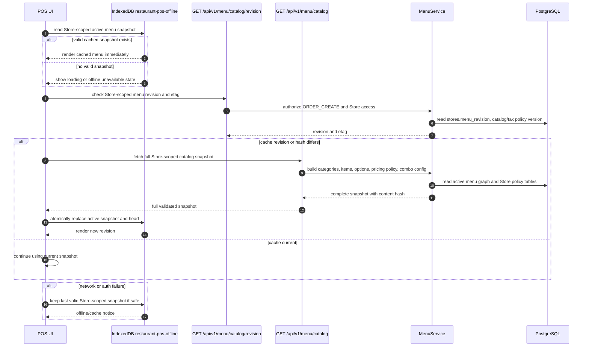

# 06 Menu Revision Cache Sequence

## Purpose

This sequence records the current offline-first menu cache architecture:
revision check, full snapshot fetch, content validation, atomic IndexedDB
replacement, and safe fallback.

## Current runtime/source SHA

- Repository source SHA: `923346f15757ca85fdafb509a803e87f04ae55bd`
- Deployed Staging SHA: `923346f15757ca85fdafb509a803e87f04ae55bd`
- Staging Flyway: `V16`
- Current observed Store menu revision: `159`

## Scope

Current frontend IndexedDB menu cache, backend catalog/revision APIs,
Store-scoped pricing/combo/menu hashing, and revision-driven refresh behavior.

## Mermaid diagram

## Key invariants

- The Pad/browser downloads a full Store-scoped menu snapshot into IndexedDB.
- The current canonical frontend cache is IndexedDB, not Android SQLite,
  SharedPreferences, raw filesystem, or a service-worker cache.
- Snapshot identity is scoped by account, Organization, Store, revision, and
  content hash.
- A new snapshot replaces the active one atomically only after validation.
- Menu Management changes increment `stores.menu_revision` and update
  `stores.menu_updated_at` in the same database transaction for pricing/combo
  policy changes.
- Existing draft/submitted order lines keep their frozen snapshots; refresh
  affects newly added lines only.

## What omitted

- browser implementation-specific HTTP cache internals
- customer PII and order history
- future A7 module-gated frontend navigation

## Source files used

- `frontend/src/offline/offlineDatabase.ts`
- `frontend/src/offline/menuCache.ts`
- `frontend/src/hooks/useMenuCatalog.ts`
- `frontend/src/services/menuService.ts`
- `backend/src/main/java/com/restaurant/system/menu/controller/MenuController.java`
- `backend/src/main/java/com/restaurant/system/menu/service/impl/MenuServiceImpl.java`
- `backend/src/main/java/com/restaurant/system/menu/service/impl/MenuRevisionServiceImpl.java`
- `backend/src/main/java/com/restaurant/system/menu/service/impl/MenuCatalogHashService.java`
- `backend/src/main/java/com/restaurant/system/menu/service/impl/StorePricingPolicyServiceImpl.java`
- `backend/src/main/java/com/restaurant/system/menu/service/impl/StoreComboConfigurationServiceImpl.java`

## Last verified date

2026-08-14.
