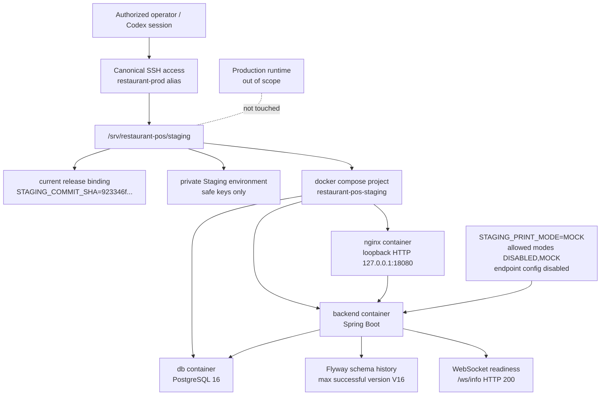

# 07 Deployment Architecture

> Phase B Part 1 Staging runtime-gate repair note: current Staging deploy
> wiring must pass `APP_FEATURES_PLATFORM=true` and
> `APP_PHASE_B_PROVISIONING_ENABLED=true` into the backend container for the
> Owner provisioning acceptance loop. Backend cloud defaults remain
> fail-closed, and Production deployment/runtime is not modified by this
> Staging-only mapping.

## Purpose

This diagram records the current Staging deployment topology and exact runtime
identity observed read-only.

## Current runtime/source SHA

- Repository source SHA: `923346f15757ca85fdafb509a803e87f04ae55bd`
- Deployed Staging SHA: `923346f15757ca85fdafb509a803e87f04ae55bd`
- Staging Flyway: `V16`
- Host observed through canonical access: `VM-0-5-ubuntu`
- Deployment root: `/srv/restaurant-pos/staging`

## Scope

Current Staging deployment only. This does not authorize or describe a deploy,
restart, Production promotion, or Production access.

## Mermaid diagram

## Key invariants

- Staging uses its own compose project and database container.
- Staging HTTP is loopback-bound on the host.
- The current application SHA and repository source SHA may differ; this
  baseline records both. For this formal baseline they match at `923346f...`.
- Staging deploy/restart/Flyway execution is not part of this documentation
  package.
- Production deployment, Production restart, Production Flyway and Production
  configuration are out of scope.

## What omitted

- raw environment file contents
- database passwords, SSH secrets, tokens, and printer endpoints
- deployment commands that would mutate runtime

## Source files used

- `deployment/cloud/docker-compose.staging.yml`
- `deployment/cloud/README_STAGING.md`
- `deployment/cloud/staging-deploy.sh`
- `docs/governance/runtime/PHASE_A5_ST_DENIS_CANONICAL_PROFILE_STAGING_EVIDENCE.md`
- `docs/governance/runtime/ALIVE_RUNTIME_PLANBOOK.md`
- `docs/governance/runtime/CURRENT_HANDOFF.md`

## Last verified date

2026-08-14.
