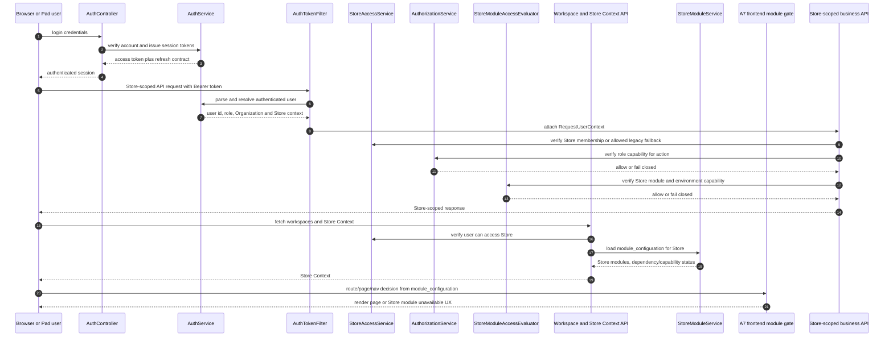

# 08 Authorization Flow

> Phase B Part 1 auth-prefix repair note: Phase B Store provisioning
> authorization is principal/role/membership/scope based. `STG005_` naming is
> retained for synthetic bootstrap/fixture identity, but username or
> `login_identifier` prefix is not a product authorization boundary for the
> Owner Store provisioning API.

> A9 update: `users.store_id` is retained only as a bounded compatibility
> fallback when no active Organization/Store membership exists. Legacy direct
> active Store creation is disabled until Phase B provisioning, and Owner
> onboarding/menu-clone HTTP facades are gated by the `PLATFORM` environment
> capability.

> A8 update: backend module access now evaluates Store module state,
> module dependencies, environment capability and hardware capability before the
> protected business action. Authorization remains membership/role/capability
> based; hardware readiness does not weaken Store access isolation.

## Purpose

This diagram records the current authentication, Store access, role capability,
and Store module context flow.

## Current runtime/source SHA

- Original A5.6 baseline source/deploy SHA:
  `923346f15757ca85fdafb509a803e87f04ae55bd`
- A6 merged source authority before A7:
  `ae144e91a7900f0a541446e93c0f498f41f670c0`
- A7 source authority:
  this package/PR; exact merged main SHA and deployed Staging SHA are recorded
  by the post-merge exact-SHA Staging deployment evidence/final report.
- Staging Flyway: `V16`

## Scope

Current backend request authentication, Store access checks, role capability
checks, A6 backend module/capability checks, and A7 Store Context-driven
frontend gating. Frontend visibility is a fail-closed UX boundary, not the
security boundary.

## Mermaid diagram

## Key invariants

- Backend authorization is the security boundary; frontend visibility is not.
- Store-scoped APIs must verify Store access before business action.
- The legacy `users.store_id` fallback is allowed only when no active
  membership provides Store access.
- Role capabilities are checked through the authorization service and registry.
- A6 backend module/capability checks run after auth, Store access and role
  capability checks.
- A7 frontend route/page/navigation visibility reads Store Context
  `module_configuration` and fails closed, but backend authorization remains
  authoritative.
- Refresh-token hashes or credential details are not exposed by this document.

## What omitted

- password hashes, refresh-token hashes, session secrets, cookies, and raw
  tokens
- exact credential policy values
- A8 hardware readiness and physical printer/device binding

## Source files used

- `backend/src/main/java/com/restaurant/system/auth/controller/AuthController.java`
- `backend/src/main/java/com/restaurant/system/auth/filter/AuthTokenFilter.java`
- `backend/src/main/java/com/restaurant/system/auth/service/impl/AuthServiceImpl.java`
- `backend/src/main/java/com/restaurant/system/common/auth/AuthorizationService.java`
- `backend/src/main/java/com/restaurant/system/common/auth/StoreAccessService.java`
- `backend/src/main/java/com/restaurant/system/common/auth/RoleCapabilityRegistry.java`
- `backend/src/main/java/com/restaurant/system/common/auth/Capability.java`
- `backend/src/main/java/com/restaurant/system/common/auth/WorkspaceController.java`
- `backend/src/main/java/com/restaurant/system/modules/StoreModuleAccessEvaluator.java`
- `backend/src/main/java/com/restaurant/system/modules/StoreModuleServiceImpl.java`
- `frontend/src/App.tsx`
- `frontend/src/features/store/storeModuleAccess.ts`
- `frontend/src/features/store/StoreContext.tsx`

## Last verified date

2026-08-14.
