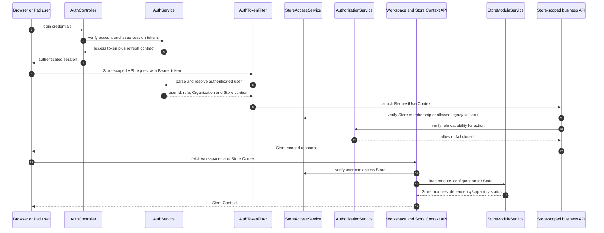

# 08 Authorization Flow

## Purpose

This diagram records the current authentication, Store access, role capability,
and Store module context flow.

## Current runtime/source SHA

- Repository source SHA: `923346f15757ca85fdafb509a803e87f04ae55bd`
- Deployed Staging SHA: `923346f15757ca85fdafb509a803e87f04ae55bd`
- Staging Flyway: `V16`

## Scope

Current backend request authentication, Store access checks, role capability
checks, and Store Context/module context read path. It does not claim frontend
module hiding is a security boundary.

## Mermaid diagram

## Key invariants

- Backend authorization is the security boundary; frontend visibility is not.
- Store-scoped APIs must verify Store access before business action.
- Role capabilities are checked through the authorization service and registry.
- Store Context includes module configuration, but full A6/A7 module
  enforcement is not yet represented as current implementation.
- Refresh-token hashes or credential details are not exposed by this document.

## What omitted

- password hashes, refresh-token hashes, session secrets, cookies, and raw
  tokens
- exact credential policy values
- future A6 module enforcement and A7 frontend gating

## Source files used

- `backend/src/main/java/com/restaurant/system/auth/controller/AuthController.java`
- `backend/src/main/java/com/restaurant/system/auth/filter/AuthTokenFilter.java`
- `backend/src/main/java/com/restaurant/system/auth/service/impl/AuthServiceImpl.java`
- `backend/src/main/java/com/restaurant/system/common/auth/AuthorizationService.java`
- `backend/src/main/java/com/restaurant/system/common/auth/StoreAccessService.java`
- `backend/src/main/java/com/restaurant/system/common/auth/RoleCapabilityRegistry.java`
- `backend/src/main/java/com/restaurant/system/common/auth/Capability.java`
- `backend/src/main/java/com/restaurant/system/common/auth/WorkspaceController.java`
- `backend/src/main/java/com/restaurant/system/modules/StoreModuleServiceImpl.java`
- `frontend/src/App.tsx`

## Last verified date

2026-08-14.
