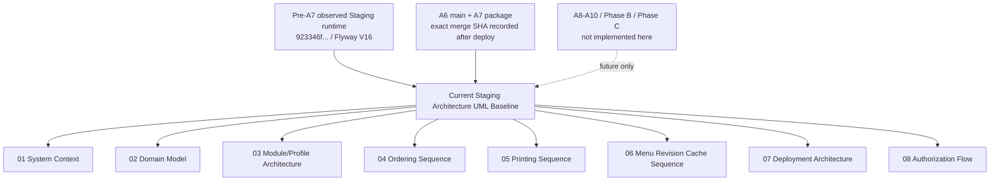

# Current Staging Architecture UML Baseline

## Purpose

This directory is the formal documentation-only anti-drift architecture
baseline for the current Phase A Staging runtime after A5.5 final UI repair.
It records what is implemented and verified today through A7 frontend module
gating, before A8 hardware capability management, Phase B Store provisioning,
or Phase C multi-Store creation.

## Current runtime/source SHA

- Original A5.6 baseline source/deploy authority:
  `923346f15757ca85fdafb509a803e87f04ae55bd`
- A6 merged source authority before A7:
  `ae144e91a7900f0a541446e93c0f498f41f670c0`
- A7 source authority:
  this package/PR; exact merged main SHA and deployed Staging SHA are recorded
  by the post-merge exact-SHA Staging deployment evidence/final report.
- Current deployed Staging application SHA observed read-only before A7 deploy:
  `923346f15757ca85fdafb509a803e87f04ae55bd`
- Current Staging Flyway: `V16`
- Current Staging deployment root: `/srv/restaurant-pos/staging`
- Current Staging compose project: `restaurant-pos-staging`
- Current Staging Store identity:
  `organization_id=1`, `store_id=1`, `store_code=STG005_SRC_20260809_R01`
- Current observed Store menu revision: `159`
- Current observed Store modules:
  `ANALYTICS_ADVANCED=false`, `KDS=false`, all core normal-store modules
  enabled
- Current Staging Printing: Store feature enabled, Store mode `MOCK`,
  runtime allowlist `DISABLED,MOCK`, endpoint configuration disabled
- Current profile identity:
  `ST_DENIS_CANONICAL_PROFILE/v1`, status `READY`,
  fingerprint
  `af1a8f34cd156c1987b74ec1a9a22ddfd004859c617937b7d53f05e16e762602`

## Scope

The diagrams cover the implemented current Staging architecture:

- system context and runtime boundaries
- Store-scoped domain model
- module catalog/dependency/profile architecture
- ordering sequence
- printing sequence
- menu revision and IndexedDB cache sequence
- Staging deployment topology
- authorization flow

They intentionally do not describe future A8-A10, Phase B, Chinatown, or
Sainte-Catherine behavior as current.

## Anti-drift authority

This package is now the `CURRENT_STAGING_ARCHITECTURE_BASELINE`. Future Phase A
backend/frontend/runtime changes must either:

- remain consistent with these diagrams and invariants; or
- update the affected file in this directory and name the architecture drift in
  the phase evidence before merge/deploy.

The baseline is descriptive, not a runtime-action approval. It does not
authorize Staging deploy/restart, Production action, Flyway history edits,
physical printer binding, Pad pairing, or Store creation.

## Mermaid diagram

## Diagram index

- [01 System Context](01_SYSTEM_CONTEXT.md)
- [02 Domain Model](02_DOMAIN_MODEL.md)
- [03 Module/Profile Architecture](03_MODULE_PROFILE_ARCHITECTURE.md)
- [04 Ordering Sequence](04_ORDERING_SEQUENCE.md)
- [05 Printing Sequence](05_PRINTING_SEQUENCE.md)
- [06 Menu Revision Cache Sequence](06_MENU_REVISION_CACHE_SEQUENCE.md)
- [07 Deployment Architecture](07_DEPLOYMENT_ARCHITECTURE.md)
- [08 Authorization Flow](08_AUTHORIZATION_FLOW.md)

## Architecture drift findings

| Finding | Classification | Current evidence | Disposition |
| --- | --- | --- | --- |
| A6 backend module gating now consumes `store_modules` after auth/Store access/role checks, with legacy environment flags and print mode classified as environment/runtime capability inputs. | `A6_IMPLEMENTED` | `StoreModuleAccessEvaluator`, `StoreModuleCapabilityProviderImpl`, current Store row `printing_enabled=true`, `printing_mode=MOCK`. | Backend module access is current architecture; A8 hardware capability remains future. |
| Live Staging Store menu option rows include legacy/null option-group compatibility rows while the A5 profile template has deterministic profile-local menu graph counts. | `BOUNDED_LEGACY_COMPATIBILITY` | Live Store observed `items=39`, `options=382`, active options `329`; A5 profile evidence records `options=380`, active profile semantics `330`. | Document that A5 profile is a reusable template, not live Store materialization. A6+ may reconcile materialization/runtime parity; this is not an A5.5 blocker. |
| `ST_DENIS_CANONICAL_PROFILE/v1` is stored and validated, but no current code path creates a live Store from it. | `PHASE_B_EXPECTED_WORK` | `StoreProfileMaterializationDryRunValidator` validates graph shape only. | Keep profile as template architecture; do not draw Phase B Store creation as current. |
| Frontend Store-scoped routes, pages and navigation now read authenticated Store Context `module_configuration` and fail closed. | `A7_IMPLEMENTED` | `frontend/src/App.tsx`, `frontend/src/features/store/storeModuleAccess.ts`, `frontend/src/features/store/StoreContext.tsx`, Owner/frontdesk navigation components. | Legacy frontend feature config remains only an environment/platform compatibility gate. |

## Key invariants

- Store state is Store-scoped and Organization-scoped where applicable.
- Store Profiles are versioned templates, not live Store database clones.
- Staging is not downgraded from Flyway V16 and no Flyway history is edited.
- Printing in current Staging is `MOCK`; physical printer binding and Pad
  pairing remain separate runtime gates.
- Store-scoped frontend module gates consume Store Context
  `module_configuration`; frontend feature config is not a Store module source.
- Production is not read or mutated by this documentation baseline.
- The source repository SHA and deployed Staging SHA may differ; the original
  A5.6 observed baseline was `923346f15757ca85fdafb509a803e87f04ae55bd`, and
  the A7 exact merged/deployed SHA is recorded after post-merge deployment.

## What omitted

- Phase B Store provisioning workflow
- real Chinatown and Sainte-Catherine Store creation
- A8 hardware capability management implementation
- physical printer endpoints, printer credentials, device tokens, and raw env
- customer PII, order history, payment data, and Production runtime details

## Source files used

- `docs/governance/runtime/ALIVE_RUNTIME_PLANBOOK.md`
- `docs/governance/runtime/CURRENT_HANDOFF.md`
- `docs/governance/agile/FINAL_PRODUCTIZATION_PLANBOOK.md`
- `docs/governance/agile/PHASE_A1_MODULE_CATALOG.md`
- `docs/governance/agile/PHASE_A2_MODULE_DEPENDENCY_GRAPH.md`
- `docs/governance/agile/PHASE_A3_STORE_LEVEL_MODULE_CONFIGURATION.md`
- `docs/governance/agile/PHASE_A4_STORE_PROFILE_CONTRACT.md`
- `docs/governance/agile/PHASE_A5_ST_DENIS_CANONICAL_PROFILE.md`
- `docs/governance/runtime/PHASE_A5_ST_DENIS_CANONICAL_PROFILE_STAGING_EVIDENCE.md`
- `backend/src/main/resources/module/module-catalog.v1.json`
- `backend/src/main/resources/module/module-dependency-graph.v1.json`
- `backend/src/main/java/com/restaurant/system/modules/StoreModuleAccessEvaluator.java`
- `backend/src/main/resources/db/migration/V11__add_store_pricing_policies.sql`
- `backend/src/main/resources/db/migration/V12__add_store_combo_components.sql`
- `backend/src/main/resources/db/migration/V13__add_store_modules.sql`
- `backend/src/main/resources/db/migration/V14__add_store_profiles.sql`
- `backend/src/main/resources/db/migration/V15__seed_st_denis_canonical_profile.sql`
- `backend/src/main/resources/db/migration/V16__add_dynamic_menu_management_configuration.sql`
- `frontend/src/App.tsx`
- `frontend/src/features/store/storeModuleAccess.ts`
- `frontend/src/features/store/StoreContext.tsx`
- `docs/governance/agile/PHASE_A6_BACKEND_MODULE_GATING_EVIDENCE.md`
- `docs/governance/agile/PHASE_A7_FRONTEND_MODULE_GATING_EVIDENCE.md`
- `deployment/cloud/docker-compose.staging.yml`
- `deployment/cloud/README_STAGING.md`
- `deployment/cloud/staging-deploy.sh`

## Last verified date

2026-08-14.
