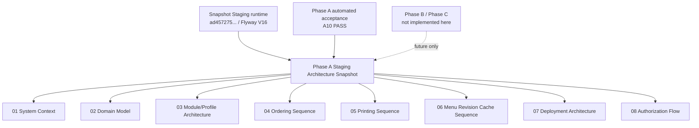

# Phase A Staging Architecture Snapshot (2026-08-14)

> **HISTORICAL ARCHITECTURE SNAPSHOT — NOT CURRENT RUNTIME AUTHORITY.** These
> diagrams captured Staging around `ad457275...` / Flyway V16. They remain
> useful architecture context, but current repository, Phase and deployment
> state must be read from fresh Git plus `docs/governance/CURRENT_STATE.yml`.
> Snapshot language such as “current” below is scoped only to the observation
> date and authorizes no action.

## Purpose

This directory preserves the documentation-only Phase A anti-drift snapshot
after A5.5 and the A6/A7/A8 architecture packages. It does not claim that the
same source, schema or runtime is currently deployed.

## Snapshot runtime/source identifiers

- Original A5.6 snapshot source/deploy evidence:
  `923346f15757ca85fdafb509a803e87f04ae55bd`
- A6 merged source before A7:
  `ae144e91a7900f0a541446e93c0f498f41f670c0`
- A8 source:
  `8796d03a2f01d3f222fa2e05fc9d2c6152f4809e`
- A9/A10 source:
  `ad4572759e01b5546ec59af24aa36b09e5c2dd00`
- Snapshot-observed Staging application SHA:
  `ad4572759e01b5546ec59af24aa36b09e5c2dd00`
- Snapshot-observed Staging Flyway: `V16`
- Snapshot deployment root: `/srv/restaurant-pos/staging`
- Snapshot compose project: `restaurant-pos-staging`
- Snapshot Store identity:
  `organization_id=1`, `store_id=1`, `store_code=STG005_SRC_20260809_R01`
- Snapshot-observed Store menu revision: `159`
- Snapshot-observed Store modules:
  `ANALYTICS_ADVANCED=false`, `KDS=false`, all core normal-store modules
  enabled
- Snapshot-observed Staging Printing: Store feature enabled, Store mode `MOCK`,
  runtime allowlist `DISABLED,MOCK`, endpoint configuration disabled
- Snapshot profile identity:
  `ST_DENIS_CANONICAL_PROFILE/v1`, status `READY`,
  fingerprint
  `af1a8f34cd156c1987b74ec1a9a22ddfd004859c617937b7d53f05e16e762602`

## Scope

The diagrams cover the architecture observed in that Staging snapshot:

- system context and runtime boundaries
- Store-scoped domain model
- module catalog/dependency/profile architecture
- ordering sequence
- printing sequence
- menu revision and IndexedDB cache sequence
- Staging deployment topology
- authorization flow

They intentionally do not claim present Phase B, Chinatown, or
Sainte-Catherine runtime behavior.

## Historical anti-drift role

This package was the `CURRENT_STAGING_ARCHITECTURE_BASELINE` for its recorded
Phase A checkpoint. Future architecture work may compare against it, but must
verify fresh code and current state rather than treating it as a live baseline.
At the checkpoint, changes were expected to either:

- remain consistent with these diagrams and invariants; or
- update the affected file in this directory and name the architecture drift in
  the phase evidence before merge/deploy.

The baseline is descriptive, not a runtime-action approval. It does not
authorize Staging deploy/restart, Production action, Flyway history edits,
physical printer binding, Pad pairing, or Store creation.

## Mermaid diagram

## Diagram index

- [01 System Context](01_SYSTEM_CONTEXT.md)
- [02 Domain Model](02_DOMAIN_MODEL.md)
- [03 Module/Profile Architecture](03_MODULE_PROFILE_ARCHITECTURE.md)
- [04 Ordering Sequence](04_ORDERING_SEQUENCE.md)
- [05 Printing Sequence](05_PRINTING_SEQUENCE.md)
- [06 Menu Revision Cache Sequence](06_MENU_REVISION_CACHE_SEQUENCE.md)
- [07 Deployment Architecture](07_DEPLOYMENT_ARCHITECTURE.md)
- [08 Authorization Flow](08_AUTHORIZATION_FLOW.md)

## Architecture drift findings

| Finding | Classification | Snapshot evidence | Historical disposition |
| --- | --- | --- | --- |
| A6 backend module gating consumed `store_modules` after auth/Store access/role checks, with legacy environment flags and print mode classified as environment/runtime capability inputs. | `A6_IMPLEMENTED` | `StoreModuleAccessEvaluator`, `StoreModuleCapabilityProviderImpl`, observed Store row `printing_enabled=true`, `printing_mode=MOCK`. | Backend module access was represented in this snapshot; A8 hardware capability was then future. |
| Live Staging Store menu option rows include legacy/null option-group compatibility rows while the A5 profile template has deterministic profile-local menu graph counts. | `BOUNDED_LEGACY_COMPATIBILITY` | Live Store observed `items=39`, `options=382`, active options `329`; A5 profile evidence records `options=380`, active profile semantics `330`. | Document that A5 profile is a reusable template, not live Store materialization. A6+ may reconcile materialization/runtime parity; this is not an A5.5 blocker. |
| `ST_DENIS_CANONICAL_PROFILE/v1` was stored and validated, but no code path at the snapshot created a live Store from it. | `PHASE_B_EXPECTED_WORK` | `StoreProfileMaterializationDryRunValidator` validated graph shape only. | The profile was template architecture; the snapshot did not include Phase B Store creation. |
| Frontend Store-scoped routes, pages and navigation now read authenticated Store Context `module_configuration` and fail closed. | `A7_IMPLEMENTED` | `frontend/src/App.tsx`, `frontend/src/features/store/storeModuleAccess.ts`, `frontend/src/features/store/StoreContext.tsx`, Owner/frontdesk navigation components. | Legacy frontend feature config remains only an environment/platform compatibility gate. |
| A8 hardware capability/readiness was a first-class contract for module access. | `A8_IMPLEMENTED` | `hardware-capability-catalog.v1.json`, `StoreModuleCapabilityProviderImpl`, Store Context `hardware_readiness`, observed MOCK Staging topology. | Physical binding and Pad pairing remained separate runtime gates. |
| A9 legacy coupling removal disables legacy direct active Store creation, gates Owner onboarding/menu-clone facades behind `PLATFORM`, and makes blank/unknown print mode fail closed to `DISABLED`. | `A9_IMPLEMENTED_AND_VALIDATED` | `PlatformAdminServiceImpl`, Owner onboarding/menu clone controllers, `PrintingRuntimePolicyProperties`, `PrinterConfigServiceImpl`, A9 compatibility ledger. | Carried into A10 automated acceptance. |
| A10 final modular acceptance validated Phase A source-of-truth, Store isolation, module gating, hardware readiness and MOCK printing. | `A10_AUTOMATED_ACCEPTANCE_PASS` | `PHASE_A10_FINAL_MODULAR_PRODUCTIZATION_ACCEPTANCE_EVIDENCE`, runtime evidence `A10_20260815T021324Z`. | Owner final Staging acceptance remains pending. |
| A later note recorded Phase B Part 1 Chain Master Menu and Store materialization as repository-implemented but not accepted in the snapshot runtime. | `PHASE_B_PART1_REPOSITORY_IMPLEMENTED_PENDING_STAGING` | `PHASE_B_PART1_IMPLEMENTATION_EVIDENCE`, V18-V21 migrations, Owner provisioning API/UI and acceptance harness. | This row is historical context; use `CURRENT_STATE.yml` for current deployment and Gate. |

## Key invariants

- Store state is Store-scoped and Organization-scoped where applicable.
- Store Profiles are versioned templates, not live Store database clones.
- At the snapshot, Staging was not downgraded from Flyway V16 and no Flyway
  history was edited.
- Printing in the snapshot Staging was `MOCK`; physical printer binding and Pad
  pairing remain separate runtime gates.
- Store-scoped frontend module gates consume Store Context
  `module_configuration`; frontend feature config is not a Store module source.
- Legacy direct active Store creation is disabled until Phase B provisioning.
- Phase B Part 1 candidate provisioning creates synthetic/non-active
  `VALIDATION_FIXTURE` Stores at `READY_FOR_REVIEW` with runtime `MOCK`
  printing mode; it does not activate real Stores.
- `stores.printing_mode` is canonical runtime mode; blank/unknown persisted
  values resolve fail-closed to `DISABLED`.
- Production was not read or mutated by creation of this snapshot.
- The source repository SHA and deployed Staging SHA may differ; the original
  A5.6 observed baseline was `923346f15757ca85fdafb509a803e87f04ae55bd`, and
  the A7 exact merged/deployed SHA is recorded after post-merge deployment.

## What omitted

- Phase B Part 2 activation/staff/hardware provisioning workflow
- real Chinatown and Sainte-Catherine Store creation
- A8 hardware capability management implementation
- physical printer endpoints, printer credentials, device tokens, and raw env
- customer PII, order history, payment data, and Production runtime details

## Source files used

- `docs/archive/governance-pre-simplification/runtime/ALIVE_RUNTIME_PLANBOOK.md`
- `docs/archive/governance-pre-simplification/runtime/CURRENT_HANDOFF.md`
- `docs/archive/governance-pre-simplification/agile/FINAL_PRODUCTIZATION_PLANBOOK.md`
- `docs/archive/governance-pre-simplification/agile/PHASE_A1_MODULE_CATALOG.md`
- `docs/archive/governance-pre-simplification/agile/PHASE_A2_MODULE_DEPENDENCY_GRAPH.md`
- `docs/archive/governance-pre-simplification/agile/PHASE_A3_STORE_LEVEL_MODULE_CONFIGURATION.md`
- `docs/archive/governance-pre-simplification/agile/PHASE_A4_STORE_PROFILE_CONTRACT.md`
- `docs/archive/governance-pre-simplification/agile/PHASE_A5_ST_DENIS_CANONICAL_PROFILE.md`
- `docs/archive/governance-pre-simplification/runtime/PHASE_A5_ST_DENIS_CANONICAL_PROFILE_STAGING_EVIDENCE.md`
- `backend/src/main/resources/module/module-catalog.v1.json`
- `backend/src/main/resources/module/module-dependency-graph.v1.json`
- `backend/src/main/java/com/restaurant/system/modules/StoreModuleAccessEvaluator.java`
- `backend/src/main/resources/db/migration/V11__add_store_pricing_policies.sql`
- `backend/src/main/resources/db/migration/V12__add_store_combo_components.sql`
- `backend/src/main/resources/db/migration/V13__add_store_modules.sql`
- `backend/src/main/resources/db/migration/V14__add_store_profiles.sql`
- `backend/src/main/resources/db/migration/V15__seed_st_denis_canonical_profile.sql`
- `backend/src/main/resources/db/migration/V16__add_dynamic_menu_management_configuration.sql`
- `frontend/src/App.tsx`
- `frontend/src/features/store/storeModuleAccess.ts`
- `frontend/src/features/store/StoreContext.tsx`
- `docs/archive/governance-pre-simplification/agile/PHASE_A6_BACKEND_MODULE_GATING_EVIDENCE.md`
- `docs/archive/governance-pre-simplification/agile/PHASE_A7_FRONTEND_MODULE_GATING_EVIDENCE.md`
- `deployment/cloud/docker-compose.staging.yml`
- `deployment/cloud/README_STAGING.md`
- `deployment/cloud/staging-deploy.sh`

## Last verified date

2026-08-14.
